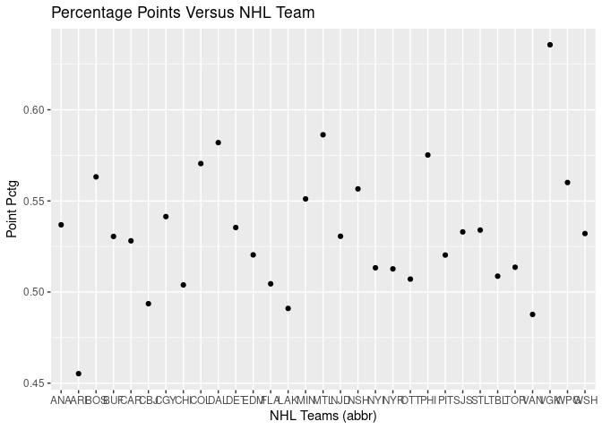

Project 1
================
Halid Kopanski
6/14/2021

  - [Create data functions](#create-data-functions)
  - [Exploratory Data Analysis](#exploratory-data-analysis)
  - [Team Specific Information](#team-specific-information)
  - [Setup ID Data](#setup-id-data)
  - [Display Data](#display-data)
  - [One Stop Shop Data](#one-stop-shop-data)

## Create data functions

## Exploratory Data Analysis

    ## No encoding supplied: defaulting to UTF-8.
    ## No encoding supplied: defaulting to UTF-8.
    ## No encoding supplied: defaulting to UTF-8.
    ## No encoding supplied: defaulting to UTF-8.
    ## No encoding supplied: defaulting to UTF-8.
    ## No encoding supplied: defaulting to UTF-8.
    ## No encoding supplied: defaulting to UTF-8.
    ## No encoding supplied: defaulting to UTF-8.

    ## [1] "id"               "firstSeasonId"    "fullName"         "lastSeasonId"    
    ## [5] "mostRecentTeamId" "teamAbbrev"       "teamCommonName"   "teamPlaceName"

    ##  [1] "id"                 "activeFranchise"    "firstSeasonId"     
    ##  [4] "franchiseId"        "gameTypeId"         "gamesPlayed"       
    ##  [7] "goalsAgainst"       "goalsFor"           "homeLosses"        
    ## [10] "homeOvertimeLosses" "homeTies"           "homeWins"          
    ## [13] "lastSeasonId"       "losses"             "overtimeLosses"    
    ## [16] "penaltyMinutes"     "pointPctg"          "points"            
    ## [19] "roadLosses"         "roadOvertimeLosses" "roadTies"          
    ## [22] "roadWins"           "shootoutLosses"     "shootoutWins"      
    ## [25] "shutouts"           "teamId"             "teamName"          
    ## [28] "ties"               "triCode"            "wins"

    ##  [1] "id"                    "active"                "captainHistory"       
    ##  [4] "coachingHistory"       "dateAwarded"           "directoryUrl"         
    ##  [7] "firstSeasonId"         "generalManagerHistory" "heroImageUrl"         
    ## [10] "mostRecentTeamId"      "retiredNumbersSummary" "teamAbbrev"           
    ## [13] "teamFullName"

    ##  [1] "id"                        "fewestGoals"              
    ##  [3] "fewestGoalsAgainst"        "fewestGoalsAgainstSeasons"
    ##  [5] "fewestGoalsSeasons"        "fewestLosses"             
    ##  [7] "fewestLossesSeasons"       "fewestPoints"             
    ##  [9] "fewestPointsSeasons"       "fewestTies"               
    ## [11] "fewestTiesSeasons"         "fewestWins"               
    ## [13] "fewestWinsSeasons"         "franchiseId"              
    ## [15] "franchiseName"             "homeLossStreak"           
    ## [17] "homeLossStreakDates"       "homePointStreak"          
    ## [19] "homePointStreakDates"      "homeWinStreak"            
    ## [21] "homeWinStreakDates"        "homeWinlessStreak"        
    ## [23] "homeWinlessStreakDates"    "lossStreak"               
    ## [25] "lossStreakDates"           "mostGameGoals"            
    ## [27] "mostGameGoalsDates"        "mostGoals"                
    ## [29] "mostGoalsAgainst"          "mostGoalsAgainstSeasons"  
    ## [31] "mostGoalsSeasons"          "mostLosses"               
    ## [33] "mostLossesSeasons"         "mostPenaltyMinutes"       
    ## [35] "mostPenaltyMinutesSeasons" "mostPoints"               
    ## [37] "mostPointsSeasons"         "mostShutouts"             
    ## [39] "mostShutoutsSeasons"       "mostTies"                 
    ## [41] "mostTiesSeasons"           "mostWins"                 
    ## [43] "mostWinsSeasons"           "pointStreak"              
    ## [45] "pointStreakDates"          "roadLossStreak"           
    ## [47] "roadLossStreakDates"       "roadPointStreak"          
    ## [49] "roadPointStreakDates"      "roadWinStreak"            
    ## [51] "roadWinStreakDates"        "roadWinlessStreak"        
    ## [53] "roadWinlessStreakDates"    "winStreak"                
    ## [55] "winStreakDates"            "winlessStreak"            
    ## [57] "winlessStreakDates"

    ##  [1] "id"                      "activePlayer"           
    ##  [3] "firstName"               "franchiseId"            
    ##  [5] "franchiseName"           "gameTypeId"             
    ##  [7] "gamesPlayed"             "lastName"               
    ##  [9] "losses"                  "mostGoalsAgainstDates"  
    ## [11] "mostGoalsAgainstOneGame" "mostSavesDates"         
    ## [13] "mostSavesOneGame"        "mostShotsAgainstDates"  
    ## [15] "mostShotsAgainstOneGame" "mostShutoutsOneSeason"  
    ## [17] "mostShutoutsSeasonIds"   "mostWinsOneSeason"      
    ## [19] "mostWinsSeasonIds"       "overtimeLosses"         
    ## [21] "playerId"                "positionCode"           
    ## [23] "rookieGamesPlayed"       "rookieShutouts"         
    ## [25] "rookieWins"              "seasons"                
    ## [27] "shutouts"                "ties"                   
    ## [29] "wins"

    ##  [1] "id"                          "activePlayer"               
    ##  [3] "assists"                     "firstName"                  
    ##  [5] "franchiseId"                 "franchiseName"              
    ##  [7] "gameTypeId"                  "gamesPlayed"                
    ##  [9] "goals"                       "lastName"                   
    ## [11] "mostAssistsGameDates"        "mostAssistsOneGame"         
    ## [13] "mostAssistsOneSeason"        "mostAssistsSeasonIds"       
    ## [15] "mostGoalsGameDates"          "mostGoalsOneGame"           
    ## [17] "mostGoalsOneSeason"          "mostGoalsSeasonIds"         
    ## [19] "mostPenaltyMinutesOneSeason" "mostPenaltyMinutesSeasonIds"
    ## [21] "mostPointsGameDates"         "mostPointsOneGame"          
    ## [23] "mostPointsOneSeason"         "mostPointsSeasonIds"        
    ## [25] "penaltyMinutes"              "playerId"                   
    ## [27] "points"                      "positionCode"               
    ## [29] "rookieGamesPlayed"           "rookiePoints"               
    ## [31] "seasons"

    ##  [1] "id"                    "name"                  "link"                 
    ##  [4] "abbreviation"          "teamName"              "locationName"         
    ##  [7] "firstYearOfPlay"       "shortName"             "officialSiteUrl"      
    ## [10] "franchiseId"           "active"                "venue.name"           
    ## [13] "venue.link"            "venue.city"            "venue.id"             
    ## [16] "venue.timeZone.id"     "venue.timeZone.offset" "venue.timeZone.tz"    
    ## [19] "division.id"           "division.name"         "division.link"        
    ## [22] "conference.id"         "conference.name"       "conference.link"      
    ## [25] "franchise.franchiseId" "franchise.teamName"    "franchise.link"

    ## NULL

## Team Specific Information

    ## No encoding supplied: defaulting to UTF-8.
    ## No encoding supplied: defaulting to UTF-8.
    ## No encoding supplied: defaulting to UTF-8.
    ## No encoding supplied: defaulting to UTF-8.
    ## No encoding supplied: defaulting to UTF-8.
    ## No encoding supplied: defaulting to UTF-8.

| id | franchiseName       | lossStreak | winStreak | mostGoals | fewestGoals |
| -: | :------------------ | ---------: | --------: | --------: | ----------: |
| 10 | Toronto Maple Leafs |         10 |        10 |       337 |         147 |

    ## No encoding supplied: defaulting to UTF-8.
    ## No encoding supplied: defaulting to UTF-8.
    ## No encoding supplied: defaulting to UTF-8.
    ## No encoding supplied: defaulting to UTF-8.

    ##  [1] "id"                      "activePlayer"           
    ##  [3] "firstName"               "franchiseId"            
    ##  [5] "franchiseName"           "gameTypeId"             
    ##  [7] "gamesPlayed"             "lastName"               
    ##  [9] "losses"                  "mostGoalsAgainstDates"  
    ## [11] "mostGoalsAgainstOneGame" "mostSavesDates"         
    ## [13] "mostSavesOneGame"        "mostShotsAgainstDates"  
    ## [15] "mostShotsAgainstOneGame" "mostShutoutsOneSeason"  
    ## [17] "mostShutoutsSeasonIds"   "mostWinsOneSeason"      
    ## [19] "mostWinsSeasonIds"       "overtimeLosses"         
    ## [21] "playerId"                "positionCode"           
    ## [23] "rookieGamesPlayed"       "rookieShutouts"         
    ## [25] "rookieWins"              "seasons"                
    ## [27] "shutouts"                "ties"                   
    ## [29] "wins"

    ##  [1] "id"                          "activePlayer"               
    ##  [3] "assists"                     "firstName"                  
    ##  [5] "franchiseId"                 "franchiseName"              
    ##  [7] "gameTypeId"                  "gamesPlayed"                
    ##  [9] "goals"                       "lastName"                   
    ## [11] "mostAssistsGameDates"        "mostAssistsOneGame"         
    ## [13] "mostAssistsOneSeason"        "mostAssistsSeasonIds"       
    ## [15] "mostGoalsGameDates"          "mostGoalsOneGame"           
    ## [17] "mostGoalsOneSeason"          "mostGoalsSeasonIds"         
    ## [19] "mostPenaltyMinutesOneSeason" "mostPenaltyMinutesSeasonIds"
    ## [21] "mostPointsGameDates"         "mostPointsOneGame"          
    ## [23] "mostPointsOneSeason"         "mostPointsSeasonIds"        
    ## [25] "penaltyMinutes"              "playerId"                   
    ## [27] "points"                      "positionCode"               
    ## [29] "rookieGamesPlayed"           "rookiePoints"               
    ## [31] "seasons"

| firstName | lastName | mostSavesOneGame | gamesPlayed |
| :-------- | :------- | ---------------: | ----------: |
| Turk      | Broda    |               NA |         629 |
| Johnny    | Bower    |               50 |         475 |
| Curtis    | Joseph   |               46 |         270 |
| Frederik  | Andersen |               54 |         268 |
| Harry     | Lumley   |               48 |         267 |
| Lorne     | Chabot   |               NA |         214 |

|   |  0 |   1 |  2 |  3 | 4 | 5 | 6 |
| :- | -: | --: | -: | -: | -: | -: | -: |
| C | 55 |  77 | 60 | 36 | 9 | 1 | 2 |
| D | 93 | 152 | 40 |  5 | 2 | 1 | 0 |
| L | 56 |  57 | 52 | 31 | 7 | 0 | 0 |
| R | 40 |  55 | 52 | 27 | 4 | 3 | 0 |

## Setup ID Data

| id | teamCommonName |
| -: | :------------- |
|  1 | Canadiens      |
|  5 | Maple Leafs    |
|  6 | Bruins         |
| 10 | Rangers        |
| 11 | Blackhawks     |
| 12 | Red Wings      |
| 14 | Kings          |
| 15 | Stars          |
| 16 | Flyers         |
| 17 | Penguins       |
| 18 | Blues          |
| 19 | Sabres         |
| 20 | Canucks        |
| 21 | Flames         |
| 22 | Islanders      |
| 23 | Devils         |
| 24 | Capitals       |
| 25 | Oilers         |
| 26 | Hurricanes     |
| 27 | Avalanche      |
| 28 | Coyotes        |
| 29 | Sharks         |
| 30 | Senators       |
| 31 | Lightning      |
| 32 | Ducks          |
| 33 | Panthers       |
| 34 | Predators      |
| 35 | Jets           |
| 36 | Blue Jackets   |
| 37 | Wild           |
| 38 | Golden Knights |
| 39 | Kraken         |

## Display Data

    ## [1] 32

    ## [1] 31

<!-- --><!-- --><!-- --><!-- --><!-- --><!-- --><!-- -->

## One Stop Shop Data

<table class="kable_wrapper">

<tbody>

<tr>

<td>

| id | firstSeasonId | fullName            | lastSeasonId | mostRecentTeamId |
| -: | ------------: | :------------------ | -----------: | ---------------: |
|  1 |      19171918 | Montréal Canadiens  |           NA |                8 |
|  2 |      19171918 | Montreal Wanderers  |     19171918 |               41 |
|  3 |      19171918 | St. Louis Eagles    |     19341935 |               45 |
|  4 |      19191920 | Hamilton Tigers     |     19241925 |               37 |
|  5 |      19171918 | Toronto Maple Leafs |           NA |               10 |
|  6 |      19241925 | Boston Bruins       |           NA |                6 |

</td>

<td>

| id | activeFranchise | firstSeasonId | franchiseId | gameTypeId |
| -: | --------------: | ------------: | ----------: | ---------: |
|  1 |               1 |      19821983 |          23 |          2 |
|  2 |               1 |      19821983 |          23 |          3 |
|  3 |               1 |      19721973 |          22 |          2 |
|  4 |               1 |      19721973 |          22 |          3 |
|  5 |               1 |      19261927 |          10 |          2 |
|  6 |               1 |      19261927 |          10 |          3 |

</td>

<td>

| firstName | lastName | mostSavesOneGame | gamesPlayed |
| :-------- | :------- | ---------------: | ----------: |
| Marty     | Turco    |               49 |         509 |
| Kari      | Lehtonen |               47 |         445 |
| Cesare    | Maniago  |               54 |         420 |
| Gilles    | Meloche  |               49 |         327 |
| Don       | Beaupre  |               52 |         315 |
| Ed        | Belfour  |               44 |         307 |

</td>

<td>

|   |  0 |  1 |  2 |  3 | 4 | 5 |
| :- | -: | -: | -: | -: | -: | -: |
| C | 35 | 47 | 46 | 18 | 6 | 1 |
| D | 80 | 97 | 24 |  5 | 0 | 0 |
| L | 24 | 54 | 36 | 18 | 2 | 0 |
| R | 26 | 46 | 36 | 14 | 4 | 0 |

</td>

<td>

| stat.gamesPlayed | stat.wins | stat.losses | stat.ot | stat.pts |
| ---------------: | :-------- | :---------- | :------ | :------- |
|               56 | 36        | 15          | 5       | 77       |
|               NA | 6th       | 6th         | 20th    | 6th      |

</td>

<td>

| id | franchiseName | lossStreak | winStreak | mostGoals | fewestGoals |
| -: | :------------ | ---------: | --------: | --------: | ----------: |
| 25 | Dallas Stars  |         10 |         7 |       346 |         189 |

</td>

</tr>

</tbody>

</table>
