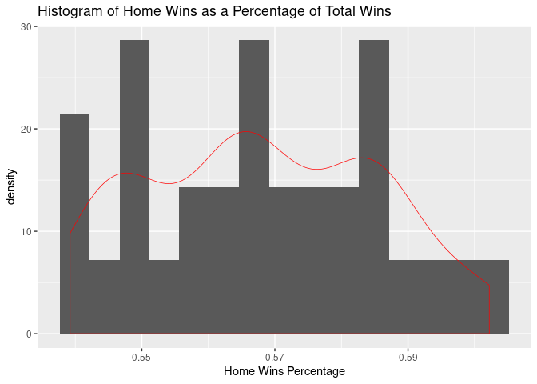

Project 1
================

  - [Link to repo](#link-to-repo)
  - [Set up of API Script](#set-up-of-api-script)
  - [Create data functions](#create-data-functions)
  - [Exploratory Data Analysis](#exploratory-data-analysis)
  - [Team Specific Information](#team-specific-information)
  - [Setup ID Data](#setup-id-data)
  - [Display Data](#display-data)
  - [One Stop Shop Data](#one-stop-shop-data)

## Link to repo

[GIT repo](https://github.com/hkopanski/ST_558_Proj_1)

## Set up of API Script

The following libraries are used in this script

``` r
library(httr)
library(jsonlite)
library(tidyverse)
library(DT)
library(RSQLite)
library(DBI)
library(knitr)
```

## Create data functions

The following functions pull data from two sources:

<https://statsapi.web.nhl.com/api/v1>

and

<https://records.nhl.com/site/api>

The data can be parsed during the request using modifiers or it can be
parsed afterwards. There are 6 functions in this section:

  - get\_db\_stats: to pull teams data from statsapi.web.nhl.com
  - get\_db\_records: to pull franchise data from records.nhl.com
  - get\_records: to pull franchise details data from records.nhl.com
  - get\_goalie\_data: pull goalie stats for a particular team
  - get\_skater\_data: pull skater stats for a particular team
  - get\_team\_stats2: pull team stats for a specific team

All functions output the data in the form of a tibble.

``` r
get_db_stats <- function(endpoint = NULL, modifier = NULL){
  base <- "https://statsapi.web.nhl.com/api/v1"
  
  URL <- paste0(base, "/" , endpoint, modifier)
  temp_con <- GET(URL)
  temp_text <- content(temp_con, "text", encoding = "UTF-8")
  temp_JSON <- fromJSON(temp_text, flatten = TRUE)
  return(as_tibble(temp_JSON))
}

get_db_records <- function(endpoint = NULL, modifier = NULL){
  base <- "https://records.nhl.com/site/api"
  
  URL <- paste0(base, "/" , endpoint, modifier)
  temp_con <- GET(URL)
  temp_text <- content(temp_con, "text", encoding = "UTF-8")
  temp_JSON <- fromJSON(temp_text, flatten = TRUE)
  return(as_tibble(temp_JSON))
}

# This is to pull team specific information
get_records <- function(team = NULL, ID = NULL){
  df_franchise_det <- get_db_records('franchise-detail')
  df_franchise_det <- df_franchise_det$data %>% rowwise() %>%
    mutate(short_name = tail(strsplit(teamFullName, " ")[[1]], n = 1))
    if(is.null(team) & !is.null(ID)){
        temp_string <- paste0('franchise-season-records?cayenneExp=franchiseId=', as.character(ID))
        get_db_records(temp_string)}
    else if(!is.null(team)){
        team_alt = tail(strsplit(team, " ")[[1]], n = 1)
        temp_ID <- df_franchise_det %>% filter(toupper(short_name) == toupper(team_alt)) %>% select(id)
        temp_string <- paste0('franchise-season-records?cayenneExp=franchiseId=', as.character(temp_ID))
        get_db_records(temp_string)
    }
}

# This pulls goalie information
get_goalie_data <- function(team = NULL, ID = NULL){
  df_franchise_det <- get_db_records('franchise-detail')
  df_franchise_det <- df_franchise_det$data %>% rowwise() %>%
    mutate(short_name = tail(strsplit(teamFullName, " ")[[1]], n = 1))
  if(is.null(team) & !is.null(ID)){
    temp_string <- paste0('franchise-goalie-records?cayenneExp=franchiseId=', as.character(ID))
    get_db_records(temp_string)}
  else if(!is.null(team)){
    team_alt = tail(strsplit(team, " ")[[1]], n = 1)
    temp_ID <- df_franchise_det %>% filter(toupper(short_name) == toupper(team_alt)) %>% select(id)
    temp_string <- paste0('franchise-goalie-records?cayenneExp=franchiseId=', as.character(temp_ID))
    get_db_records(temp_string)
  }
}

# This pulls skater information
get_skater_data <- function(team = NULL, ID = NULL){
  df_franchise_det <- get_db_records('franchise-detail')
  df_franchise_det <- df_franchise_det$data %>% rowwise() %>%
    mutate(short_name = tail(strsplit(teamFullName, " ")[[1]], n = 1))
  if(is.null(team) & !is.null(ID)){
    temp_string <- paste0('franchise-skater-records?cayenneExp=franchiseId=', as.character(ID))
    get_db_records(temp_string)}
  else if(!is.null(team)){
    team_alt = tail(strsplit(team, " ")[[1]], n = 1)
    temp_ID <- df_franchise_det %>% filter(toupper(short_name) == toupper(team_alt)) %>% select(id)
    temp_string <- paste0('franchise-skater-records?cayenneExp=franchiseId=', as.character(temp_ID))
    get_db_records(temp_string)
  }
}

get_team_stats2 <- function(team = NULL){
  df_franchise_det <- get_db_records('franchise-detail')
  df_franchise_det <- df_franchise_det$data %>% rowwise() %>%
    mutate(short_name = tail(strsplit(teamFullName, " ")[[1]], n = 1))
  
  if(is.numeric(team)){
    temp_string <- paste0('teams/', as.character(team))
    return(get_db_stats(temp_string, '?expand=team.stats'))}
  
  else if(is.character(team)){
    team_alt = tail(strsplit(team, " ")[[1]], n = 1)
    temp_ID <- df_franchise_det %>% filter(toupper(short_name) == toupper(team_alt)) %>% select(id)
    temp_string <- paste0('teams/', as.character(temp_ID))
    temp_df <- get_db_stats(temp_string, '?expand=team.stats')
    temp_df <- temp_df$teams$teamStats[[1]]
    temp_df <- temp_df$splits[[1]]
    return(temp_df)}
  
  else {
    return(get_db_stats('teams'))
  }
}
```

## Exploratory Data Analysis

The functions developed in the prior section will be used to connect to
and to pull data from the NHL API service. First, the some datasets will
be created using the following commands.

Here are the column names for all the datasets. In the case of the data
sets for a particular team, one was chosen at random.

``` r
# Column names of each dataset
names(df_franchise$data)
```

    ## [1] "id"               "firstSeasonId"    "fullName"         "lastSeasonId"    
    ## [5] "mostRecentTeamId" "teamAbbrev"       "teamCommonName"   "teamPlaceName"

``` r
names(df_fran_team_tot$data)
```

    ##  [1] "id"                 "activeFranchise"    "firstSeasonId"     
    ##  [4] "franchiseId"        "gameTypeId"         "gamesPlayed"       
    ##  [7] "goalsAgainst"       "goalsFor"           "homeLosses"        
    ## [10] "homeOvertimeLosses" "homeTies"           "homeWins"          
    ## [13] "lastSeasonId"       "losses"             "overtimeLosses"    
    ## [16] "penaltyMinutes"     "pointPctg"          "points"            
    ## [19] "roadLosses"         "roadOvertimeLosses" "roadTies"          
    ## [22] "roadWins"           "shootoutLosses"     "shootoutWins"      
    ## [25] "shutouts"           "teamId"             "teamName"          
    ## [28] "ties"               "triCode"            "wins"

``` r
names(df_franchise_det$data)
```

    ##  [1] "id"                    "active"                "captainHistory"       
    ##  [4] "coachingHistory"       "dateAwarded"           "directoryUrl"         
    ##  [7] "firstSeasonId"         "generalManagerHistory" "heroImageUrl"         
    ## [10] "mostRecentTeamId"      "retiredNumbersSummary" "teamAbbrev"           
    ## [13] "teamFullName"

``` r
names(df_records$data) #Data for the Flyers
```

    ##  [1] "id"                        "fewestGoals"              
    ##  [3] "fewestGoalsAgainst"        "fewestGoalsAgainstSeasons"
    ##  [5] "fewestGoalsSeasons"        "fewestLosses"             
    ##  [7] "fewestLossesSeasons"       "fewestPoints"             
    ##  [9] "fewestPointsSeasons"       "fewestTies"               
    ## [11] "fewestTiesSeasons"         "fewestWins"               
    ## [13] "fewestWinsSeasons"         "franchiseId"              
    ## [15] "franchiseName"             "homeLossStreak"           
    ## [17] "homeLossStreakDates"       "homePointStreak"          
    ## [19] "homePointStreakDates"      "homeWinStreak"            
    ## [21] "homeWinStreakDates"        "homeWinlessStreak"        
    ## [23] "homeWinlessStreakDates"    "lossStreak"               
    ## [25] "lossStreakDates"           "mostGameGoals"            
    ## [27] "mostGameGoalsDates"        "mostGoals"                
    ## [29] "mostGoalsAgainst"          "mostGoalsAgainstSeasons"  
    ## [31] "mostGoalsSeasons"          "mostLosses"               
    ## [33] "mostLossesSeasons"         "mostPenaltyMinutes"       
    ## [35] "mostPenaltyMinutesSeasons" "mostPoints"               
    ## [37] "mostPointsSeasons"         "mostShutouts"             
    ## [39] "mostShutoutsSeasons"       "mostTies"                 
    ## [41] "mostTiesSeasons"           "mostWins"                 
    ## [43] "mostWinsSeasons"           "pointStreak"              
    ## [45] "pointStreakDates"          "roadLossStreak"           
    ## [47] "roadLossStreakDates"       "roadPointStreak"          
    ## [49] "roadPointStreakDates"      "roadWinStreak"            
    ## [51] "roadWinStreakDates"        "roadWinlessStreak"        
    ## [53] "roadWinlessStreakDates"    "winStreak"                
    ## [55] "winStreakDates"            "winlessStreak"            
    ## [57] "winlessStreakDates"

``` r
names(df_goalie_bruins$data) #goalie data for the Bruins :(
```

    ##  [1] "id"                      "activePlayer"           
    ##  [3] "firstName"               "franchiseId"            
    ##  [5] "franchiseName"           "gameTypeId"             
    ##  [7] "gamesPlayed"             "lastName"               
    ##  [9] "losses"                  "mostGoalsAgainstDates"  
    ## [11] "mostGoalsAgainstOneGame" "mostSavesDates"         
    ## [13] "mostSavesOneGame"        "mostShotsAgainstDates"  
    ## [15] "mostShotsAgainstOneGame" "mostShutoutsOneSeason"  
    ## [17] "mostShutoutsSeasonIds"   "mostWinsOneSeason"      
    ## [19] "mostWinsSeasonIds"       "overtimeLosses"         
    ## [21] "playerId"                "positionCode"           
    ## [23] "rookieGamesPlayed"       "rookieShutouts"         
    ## [25] "rookieWins"              "seasons"                
    ## [27] "shutouts"                "ties"                   
    ## [29] "wins"

``` r
names(df_skater_bruins$data) #skater data for the Bruins
```

    ##  [1] "id"                          "activePlayer"               
    ##  [3] "assists"                     "firstName"                  
    ##  [5] "franchiseId"                 "franchiseName"              
    ##  [7] "gameTypeId"                  "gamesPlayed"                
    ##  [9] "goals"                       "lastName"                   
    ## [11] "mostAssistsGameDates"        "mostAssistsOneGame"         
    ## [13] "mostAssistsOneSeason"        "mostAssistsSeasonIds"       
    ## [15] "mostGoalsGameDates"          "mostGoalsOneGame"           
    ## [17] "mostGoalsOneSeason"          "mostGoalsSeasonIds"         
    ## [19] "mostPenaltyMinutesOneSeason" "mostPenaltyMinutesSeasonIds"
    ## [21] "mostPointsGameDates"         "mostPointsOneGame"          
    ## [23] "mostPointsOneSeason"         "mostPointsSeasonIds"        
    ## [25] "penaltyMinutes"              "playerId"                   
    ## [27] "points"                      "positionCode"               
    ## [29] "rookieGamesPlayed"           "rookiePoints"               
    ## [31] "seasons"

``` r
names(df_teams$teams)
```

    ##  [1] "id"                    "name"                  "link"                 
    ##  [4] "abbreviation"          "teamName"              "locationName"         
    ##  [7] "firstYearOfPlay"       "shortName"             "officialSiteUrl"      
    ## [10] "franchiseId"           "active"                "venue.name"           
    ## [13] "venue.link"            "venue.city"            "venue.id"             
    ## [16] "venue.timeZone.id"     "venue.timeZone.offset" "venue.timeZone.tz"    
    ## [19] "division.id"           "division.name"         "division.link"        
    ## [22] "conference.id"         "conference.name"       "conference.link"      
    ## [25] "franchise.franchiseId" "franchise.teamName"    "franchise.link"

``` r
names(df_bruins)
```

    ##  [1] "stat.gamesPlayed"              "stat.wins"                    
    ##  [3] "stat.losses"                   "stat.ot"                      
    ##  [5] "stat.pts"                      "stat.ptPctg"                  
    ##  [7] "stat.goalsPerGame"             "stat.goalsAgainstPerGame"     
    ##  [9] "stat.evGGARatio"               "stat.powerPlayPercentage"     
    ## [11] "stat.powerPlayGoals"           "stat.powerPlayGoalsAgainst"   
    ## [13] "stat.powerPlayOpportunities"   "stat.penaltyKillPercentage"   
    ## [15] "stat.shotsPerGame"             "stat.shotsAllowed"            
    ## [17] "stat.winScoreFirst"            "stat.winOppScoreFirst"        
    ## [19] "stat.winLeadFirstPer"          "stat.winLeadSecondPer"        
    ## [21] "stat.winOutshootOpp"           "stat.winOutshotByOpp"         
    ## [23] "stat.faceOffsTaken"            "stat.faceOffsWon"             
    ## [25] "stat.faceOffsLost"             "stat.faceOffWinPercentage"    
    ## [27] "stat.shootingPctg"             "stat.savePctg"                
    ## [29] "stat.penaltyKillOpportunities" "stat.savePctRank"             
    ## [31] "stat.shootingPctRank"          "team.id"                      
    ## [33] "team.name"                     "team.link"

Here is some dataframe information

``` r
# Information for each dataset
str(df_franchise$data)
```

    ## 'data.frame':    39 obs. of  8 variables:
    ##  $ id              : int  1 2 3 4 5 6 7 8 9 10 ...
    ##  $ firstSeasonId   : int  19171918 19171918 19171918 19191920 19171918 19241925 19241925 19251926 19251926 19261927 ...
    ##  $ fullName        : chr  "Montréal Canadiens" "Montreal Wanderers" "St. Louis Eagles" "Hamilton Tigers" ...
    ##  $ lastSeasonId    : int  NA 19171918 19341935 19241925 NA NA 19371938 19411942 19301931 NA ...
    ##  $ mostRecentTeamId: int  8 41 45 37 10 6 43 51 39 3 ...
    ##  $ teamAbbrev      : chr  "MTL" "MWN" "SLE" "HAM" ...
    ##  $ teamCommonName  : chr  "Canadiens" "Wanderers" "Eagles" "Tigers" ...
    ##  $ teamPlaceName   : chr  "Montréal" "Montreal" "St. Louis" "Hamilton" ...

``` r
str(df_fran_team_tot$data)
```

    ## 'data.frame':    105 obs. of  30 variables:
    ##  $ id                : int  1 2 3 4 5 6 7 8 9 10 ...
    ##  $ activeFranchise   : int  1 1 1 1 1 1 1 1 1 1 ...
    ##  $ firstSeasonId     : int  19821983 19821983 19721973 19721973 19261927 19261927 19671968 19671968 19671968 19671968 ...
    ##  $ franchiseId       : int  23 23 22 22 10 10 16 16 17 17 ...
    ##  $ gameTypeId        : int  2 3 2 3 2 3 3 2 2 3 ...
    ##  $ gamesPlayed       : int  2993 257 3788 310 6560 518 449 4171 4171 391 ...
    ##  $ goalsAgainst      : int  8902 634 11907 899 20020 1447 1332 12255 14049 1131 ...
    ##  $ goalsFor          : int  8792 697 12045 986 20041 1404 1335 13690 13874 1190 ...
    ##  $ homeLosses        : int  525 53 678 53 1143 104 97 584 683 85 ...
    ##  $ homeOvertimeLosses: int  85 0 84 1 76 0 0 93 60 0 ...
    ##  $ homeTies          : int  96 NA 170 NA 448 1 NA 193 205 NA ...
    ##  $ homeWins          : int  790 74 963 95 1614 137 135 1216 1138 113 ...
    ##  $ lastSeasonId      : int  NA NA NA NA NA NA NA NA NA NA ...
    ##  $ losses            : int  1211 120 1587 139 2716 266 218 1452 1734 182 ...
    ##  $ overtimeLosses    : int  169 0 166 0 153 0 0 183 151 0 ...
    ##  $ penaltyMinutes    : int  44773 4266 57792 5693 86129 8181 9104 76208 66221 6106 ...
    ##  $ pointPctg         : num  0.5306 0.0039 0.5133 0.0129 0.5127 ...
    ##  $ points            : int  3176 2 3889 8 6727 0 4 4798 4340 12 ...
    ##  $ roadLosses        : int  686 67 909 86 1573 162 121 868 1051 97 ...
    ##  $ roadOvertimeLosses: int  84 0 82 2 77 0 0 90 91 1 ...
    ##  $ roadTies          : int  123 NA 177 NA 360 7 NA 264 178 NA ...
    ##  $ roadWins          : int  604 63 725 76 1269 107 96 863 765 96 ...
    ##  $ shootoutLosses    : int  84 0 70 0 68 0 0 92 54 0 ...
    ##  $ shootoutWins      : int  78 0 86 0 79 0 0 53 83 0 ...
    ##  $ shutouts          : int  196 25 177 12 408 44 33 248 189 30 ...
    ##  $ teamId            : int  1 1 2 2 3 3 4 4 5 5 ...
    ##  $ teamName          : chr  "New Jersey Devils" "New Jersey Devils" "New York Islanders" "New York Islanders" ...
    ##  $ ties              : int  219 NA 347 NA 808 8 NA 457 383 NA ...
    ##  $ triCode           : chr  "NJD" "NJD" "NYI" "NYI" ...
    ##  $ wins              : int  1394 137 1688 171 2883 244 231 2079 1903 209 ...

``` r
str(df_franchise_det$data)
```

    ## 'data.frame':    39 obs. of  13 variables:
    ##  $ id                   : int  1 2 3 4 5 6 7 8 9 10 ...
    ##  $ active               : logi  TRUE FALSE FALSE FALSE TRUE TRUE ...
    ##  $ captainHistory       : chr  "<ul class=\"striped-list\">\r\n\t<li>Shea Weber: 2018-19 &ndash; Present</li>\r\n\t<li>Max Pacioretty: 2015-16 "| __truncated__ NA NA NA ...
    ##  $ coachingHistory      : chr  "<ul class=\"striped-list\">\r\n\t<li>Dominique Ducharme: Feb. 25, 2021&nbsp;&ndash; Present</li>\r\n\t<li>Claud"| __truncated__ NA NA NA ...
    ##  $ dateAwarded          : chr  "1917-11-26T00:00:00" "1917-11-26T00:00:00" "1917-11-26T00:00:00" "1917-11-26T00:00:00" ...
    ##  $ directoryUrl         : chr  "https://www.nhl.com/canadiens/team/administration" NA NA NA ...
    ##  $ firstSeasonId        : int  19171918 19171918 19171918 19191920 19171918 19241925 19241925 19251926 19251926 19261927 ...
    ##  $ generalManagerHistory: chr  "<ul class=\"striped-list\">\r\n\t<li>Marc Bergevin: May 2, 2012 &ndash; Present</li>\r\n\t<li>Pierre Gauthier: "| __truncated__ NA NA NA ...
    ##  $ heroImageUrl         : chr  "https://records.nhl.com/site/asset/public/ext/hero/Team Pages/MTL/Price.jpg" "https://records.nhl.com/site/asset/public/images/hero/teams/defunct-franchises/montreal-wanderers.jpg" "https://records.nhl.com/site/asset/public/ext/hero/Team Pages/1927SEN.JPG" "https://records.nhl.com/site/asset/public/images/hero/teams/defunct-franchises/hamilton-tigers.jpg" ...
    ##  $ mostRecentTeamId     : int  8 41 45 37 10 6 43 51 39 3 ...
    ##  $ retiredNumbersSummary: chr  "<ul class=\"striped-list\">\r\n\t<li>1 &ndash;&nbsp;Jacques Plante (1952-63)</li>\r\n\t<li>2 &ndash;&nbsp;Doug "| __truncated__ NA NA NA ...
    ##  $ teamAbbrev           : chr  "MTL" "MWN" "SLE" "HAM" ...
    ##  $ teamFullName         : chr  "Montréal Canadiens" "Montreal Wanderers" "St. Louis Eagles" "Hamilton Tigers" ...

``` r
str(df_records$data) #Data for the Flyers
```

    ## 'data.frame':    1 obs. of  57 variables:
    ##  $ id                       : int 4
    ##  $ fewestGoals              : int 173
    ##  $ fewestGoalsAgainst       : int 164
    ##  $ fewestGoalsAgainstSeasons: chr "1973-74 (78)"
    ##  $ fewestGoalsSeasons       : chr "1967-68 (74)"
    ##  $ fewestLosses             : int 12
    ##  $ fewestLossesSeasons      : chr "1979-80 (80)"
    ##  $ fewestPoints             : int 56
    ##  $ fewestPointsSeasons      : chr "2006-07 (82)"
    ##  $ fewestTies               : int 4
    ##  $ fewestTiesSeasons        : chr "1985-86 (80)"
    ##  $ fewestWins               : int 17
    ##  $ fewestWinsSeasons        : chr "1969-70 (76)"
    ##  $ franchiseId              : int 16
    ##  $ franchiseName            : chr "Philadelphia Flyers"
    ##  $ homeLossStreak           : int 8
    ##  $ homeLossStreakDates      : chr "Dec 09 2006 - Jan 27 2007"
    ##  $ homePointStreak          : int 26
    ##  $ homePointStreakDates     : chr "Oct 11 1979 - Feb 03 1980"
    ##  $ homeWinStreak            : int 20
    ##  $ homeWinStreakDates       : chr "Jan 04 1976 - Apr 03 1976"
    ##  $ homeWinlessStreak        : int 13
    ##  $ homeWinlessStreakDates   : chr "Nov 29 2006 - Feb 08 2007"
    ##  $ lossStreak               : int 9
    ##  $ lossStreakDates          : chr "Dec 08 2006 - Dec 27 2006"
    ##  $ mostGameGoals            : int 13
    ##  $ mostGameGoalsDates       : chr "Mar 22 1984 - PIT 4 @ PHI 13, Oct 18 1984 - VAN 2 @ PHI 13"
    ##  $ mostGoals                : int 350
    ##  $ mostGoalsAgainst         : int 319
    ##  $ mostGoalsAgainstSeasons  : chr "1992-93 (84)"
    ##  $ mostGoalsSeasons         : chr "1983-84 (80)"
    ##  $ mostLosses               : int 48
    ##  $ mostLossesSeasons        : chr "2006-07 (82)"
    ##  $ mostPenaltyMinutes       : int 2621
    ##  $ mostPenaltyMinutesSeasons: chr "1980-81 (80)"
    ##  $ mostPoints               : int 118
    ##  $ mostPointsSeasons        : chr "1975-76 (80)"
    ##  $ mostShutouts             : int 13
    ##  $ mostShutoutsSeasons      : chr "1974-75 (80)"
    ##  $ mostTies                 : int 24
    ##  $ mostTiesSeasons          : chr "1969-70 (76)"
    ##  $ mostWins                 : int 53
    ##  $ mostWinsSeasons          : chr "1984-85 (80), 1985-86 (80)"
    ##  $ pointStreak              : int 35
    ##  $ pointStreakDates         : chr "Oct 14 1979 - Jan 06 1980"
    ##  $ roadLossStreak           : int 8
    ##  $ roadLossStreakDates      : chr "Oct 25 1972 - Nov 26 1972, Mar 03 1988 - Mar 29 1988"
    ##  $ roadPointStreak          : int 16
    ##  $ roadPointStreakDates     : chr "Oct 20 1979 - Jan 06 1980"
    ##  $ roadWinStreak            : int 8
    ##  $ roadWinStreakDates       : chr "Dec 22 1982 - Jan 16 1983"
    ##  $ roadWinlessStreak        : int 19
    ##  $ roadWinlessStreakDates   : chr "Oct 23 1971 - Jan 27 1972"
    ##  $ winStreak                : int 13
    ##  $ winStreakDates           : chr "Oct 19 1985 - Nov 17 1985"
    ##  $ winlessStreak            : int 12
    ##  $ winlessStreakDates       : chr "Feb 24 1999 - Mar 16 1999"

``` r
str(df_goalie_bruins$data) #goalie data for the Bruins :(
```

    ## 'data.frame':    51 obs. of  29 variables:
    ##  $ id                     : int  347 352 356 374 380 427 432 438 479 487 ...
    ##  $ activePlayer           : logi  FALSE FALSE FALSE FALSE FALSE FALSE ...
    ##  $ firstName              : chr  "Yves" "Daniel" "Craig" "Jon" ...
    ##  $ franchiseId            : int  6 6 6 6 6 6 6 6 6 6 ...
    ##  $ franchiseName          : chr  "Boston Bruins" "Boston Bruins" "Boston Bruins" "Boston Bruins" ...
    ##  $ gameTypeId             : int  2 2 2 2 2 2 2 2 2 2 ...
    ##  $ gamesPlayed            : int  8 8 35 57 2 277 40 18 154 183 ...
    ##  $ lastName               : chr  "Belanger" "Berthiaume" "Billington" "Casey" ...
    ##  $ losses                 : int  0 4 14 15 1 73 6 9 46 62 ...
    ##  $ mostGoalsAgainstDates  : chr  "1979-10-23" "1992-03-08, 1992-01-25" "1995-10-14" "1993-11-24" ...
    ##  $ mostGoalsAgainstOneGame: int  5 4 6 7 4 9 7 5 8 8 ...
    ##  $ mostSavesDates         : chr  "1979-11-02" "1992-03-07" "1996-01-13" "1994-03-14" ...
    ##  $ mostSavesOneGame       : int  24 26 34 31 15 41 27 43 37 39 ...
    ##  $ mostShotsAgainstDates  : chr  "1979-11-02" "1992-03-07, 1992-01-23" "1996-01-13" "1994-03-14" ...
    ##  $ mostShotsAgainstOneGame: int  27 28 36 36 19 44 31 47 40 42 ...
    ##  $ mostShutoutsOneSeason  : int  0 0 1 4 0 6 3 1 2 3 ...
    ##  $ mostShutoutsSeasonIds  : chr  "19791980" "19911992" "19951996" "19931994" ...
    ##  $ mostWinsOneSeason      : int  2 1 10 30 0 34 26 8 19 24 ...
    ##  $ mostWinsSeasonIds      : chr  "19791980" "19911992" "19951996" "19931994" ...
    ##  $ overtimeLosses         : int  NA NA NA NA NA NA NA NA NA NA ...
    ##  $ playerId               : int  8445403 8445462 8445470 8446011 8446082 8447170 8447344 8447449 8448410 8448759 ...
    ##  $ positionCode           : chr  "G" "G" "G" "G" ...
    ##  $ rookieGamesPlayed      : int  NA NA NA NA NA NA NA NA NA NA ...
    ##  $ rookieShutouts         : int  NA NA NA NA NA NA NA NA NA NA ...
    ##  $ rookieWins             : int  NA NA NA NA NA NA NA NA NA NA ...
    ##  $ seasons                : int  1 1 2 1 1 7 1 1 5 6 ...
    ##  $ shutouts               : int  0 0 1 4 0 16 3 1 4 6 ...
    ##  $ ties                   : int  3 2 3 9 0 39 7 0 13 17 ...
    ##  $ wins                   : int  2 1 15 30 0 155 26 8 83 92 ...

``` r
str(df_skater_bruins$data) #skater data for the Bruins
```

    ## 'data.frame':    918 obs. of  31 variables:
    ##  $ id                         : int  17259 17335 17348 17357 17406 17414 17488 17500 17511 17525 ...
    ##  $ activePlayer               : logi  FALSE FALSE FALSE FALSE FALSE FALSE ...
    ##  $ assists                    : int  0 1 3 0 2 0 2 0 0 5 ...
    ##  $ firstName                  : chr  "Rick" "John" "Barry" "Steve" ...
    ##  $ franchiseId                : int  6 6 6 6 6 6 6 6 6 6 ...
    ##  $ franchiseName              : chr  "Boston Bruins" "Boston Bruins" "Boston Bruins" "Boston Bruins" ...
    ##  $ gameTypeId                 : int  2 2 2 2 2 2 2 2 2 2 ...
    ##  $ gamesPlayed                : int  1 6 14 1 15 7 8 2 8 6 ...
    ##  $ goals                      : int  0 0 0 0 0 0 0 0 0 0 ...
    ##  $ lastName                   : chr  "Adduono" "Arbour" "Ashbee" "Atkinson" ...
    ##  $ mostAssistsGameDates       : chr  "1975-10-09, 1975-10-12, 1975-10-16, 1975-10-18, 1975-10-19, 1975-10-23, 1975-10-25, 1975-10-26, 1975-10-30, 197"| __truncated__ "1968-01-21" "1965-11-25, 1965-12-01, 1965-12-15" "1968-10-11, 1968-10-13, 1968-10-16, 1968-10-17, 1968-10-19, 1968-10-24, 1968-10-26, 1968-10-27, 1968-10-30, 196"| __truncated__ ...
    ##  $ mostAssistsOneGame         : int  0 1 1 0 1 0 1 0 0 2 ...
    ##  $ mostAssistsOneSeason       : int  0 1 3 0 2 0 2 0 0 5 ...
    ##  $ mostAssistsSeasonIds       : chr  "19751976" "19671968" "19651966" "19681969" ...
    ##  $ mostGoalsGameDates         : chr  "1975-10-09, 1975-10-12, 1975-10-16, 1975-10-18, 1975-10-19, 1975-10-23, 1975-10-25, 1975-10-26, 1975-10-30, 197"| __truncated__ "1965-10-24, 1965-10-27, 1965-10-30, 1965-11-03, 1965-11-04, 1965-11-06, 1965-11-07, 1965-11-10, 1965-11-14, 196"| __truncated__ "1965-10-24, 1965-10-27, 1965-10-30, 1965-11-03, 1965-11-04, 1965-11-06, 1965-11-07, 1965-11-10, 1965-11-14, 196"| __truncated__ "1968-10-11, 1968-10-13, 1968-10-16, 1968-10-17, 1968-10-19, 1968-10-24, 1968-10-26, 1968-10-27, 1968-10-30, 196"| __truncated__ ...
    ##  $ mostGoalsOneGame           : int  0 0 0 0 0 0 0 0 0 0 ...
    ##  $ mostGoalsOneSeason         : int  0 0 0 0 0 0 0 0 0 0 ...
    ##  $ mostGoalsSeasonIds         : chr  "19751976" "19651966, 19671968" "19651966" "19681969" ...
    ##  $ mostPenaltyMinutesOneSeason: int  0 11 14 0 26 2 4 0 0 4 ...
    ##  $ mostPenaltyMinutesSeasonIds: chr  "19751976" "19671968" "19651966" "19681969" ...
    ##  $ mostPointsGameDates        : chr  "1975-10-09, 1975-10-12, 1975-10-16, 1975-10-18, 1975-10-19, 1975-10-23, 1975-10-25, 1975-10-26, 1975-10-30, 197"| __truncated__ "1968-01-21" "1965-11-25, 1965-12-01, 1965-12-15" "1968-10-11, 1968-10-13, 1968-10-16, 1968-10-17, 1968-10-19, 1968-10-24, 1968-10-26, 1968-10-27, 1968-10-30, 196"| __truncated__ ...
    ##  $ mostPointsOneGame          : int  0 1 1 0 1 0 1 0 0 2 ...
    ##  $ mostPointsOneSeason        : int  0 1 3 0 2 0 2 0 0 5 ...
    ##  $ mostPointsSeasonIds        : chr  "19751976" "19671968" "19651966" "19681969" ...
    ##  $ penaltyMinutes             : int  0 11 14 0 26 2 4 0 0 4 ...
    ##  $ playerId                   : int  8444899 8444966 8444980 8444984 8445005 8445009 8445061 8445068 8445074 8445084 ...
    ##  $ points                     : int  0 1 3 0 2 0 2 0 0 5 ...
    ##  $ positionCode               : chr  "C" "D" "D" "R" ...
    ##  $ rookieGamesPlayed          : int  1 4 14 1 NA 7 8 2 8 6 ...
    ##  $ rookiePoints               : int  0 1 3 0 NA 0 2 0 0 5 ...
    ##  $ seasons                    : int  1 2 1 1 1 1 1 1 1 1 ...

``` r
str(df_teams$teams)
```

    ## 'data.frame':    32 obs. of  27 variables:
    ##  $ id                   : int  1 2 3 4 5 6 7 8 9 10 ...
    ##  $ name                 : chr  "New Jersey Devils" "New York Islanders" "New York Rangers" "Philadelphia Flyers" ...
    ##  $ link                 : chr  "/api/v1/teams/1" "/api/v1/teams/2" "/api/v1/teams/3" "/api/v1/teams/4" ...
    ##  $ abbreviation         : chr  "NJD" "NYI" "NYR" "PHI" ...
    ##  $ teamName             : chr  "Devils" "Islanders" "Rangers" "Flyers" ...
    ##  $ locationName         : chr  "New Jersey" "New York" "New York" "Philadelphia" ...
    ##  $ firstYearOfPlay      : chr  "1982" "1972" "1926" "1967" ...
    ##  $ shortName            : chr  "New Jersey" "NY Islanders" "NY Rangers" "Philadelphia" ...
    ##  $ officialSiteUrl      : chr  "http://www.newjerseydevils.com/" "http://www.newyorkislanders.com/" "http://www.newyorkrangers.com/" "http://www.philadelphiaflyers.com/" ...
    ##  $ franchiseId          : int  23 22 10 16 17 6 19 1 30 5 ...
    ##  $ active               : logi  TRUE TRUE TRUE TRUE TRUE TRUE ...
    ##  $ venue.name           : chr  "Prudential Center" "Nassau Veterans Memorial Coliseum" "Madison Square Garden" "Wells Fargo Center" ...
    ##  $ venue.link           : chr  "/api/v1/venues/null" "/api/v1/venues/null" "/api/v1/venues/5054" "/api/v1/venues/5096" ...
    ##  $ venue.city           : chr  "Newark" "Uniondale" "New York" "Philadelphia" ...
    ##  $ venue.id             : int  NA NA 5054 5096 5034 5085 5039 5028 5031 NA ...
    ##  $ venue.timeZone.id    : chr  "America/New_York" "America/New_York" "America/New_York" "America/New_York" ...
    ##  $ venue.timeZone.offset: int  -4 -4 -4 -4 -4 -4 -4 -4 -4 -4 ...
    ##  $ venue.timeZone.tz    : chr  "EDT" "EDT" "EDT" "EDT" ...
    ##  $ division.id          : int  25 25 25 25 25 25 25 28 28 28 ...
    ##  $ division.name        : chr  "MassMutual East" "MassMutual East" "MassMutual East" "MassMutual East" ...
    ##  $ division.link        : chr  "/api/v1/divisions/25" "/api/v1/divisions/25" "/api/v1/divisions/25" "/api/v1/divisions/25" ...
    ##  $ conference.id        : int  6 6 6 6 6 6 6 6 6 6 ...
    ##  $ conference.name      : chr  "Eastern" "Eastern" "Eastern" "Eastern" ...
    ##  $ conference.link      : chr  "/api/v1/conferences/6" "/api/v1/conferences/6" "/api/v1/conferences/6" "/api/v1/conferences/6" ...
    ##  $ franchise.franchiseId: int  23 22 10 16 17 6 19 1 30 5 ...
    ##  $ franchise.teamName   : chr  "Devils" "Islanders" "Rangers" "Flyers" ...
    ##  $ franchise.link       : chr  "/api/v1/franchises/23" "/api/v1/franchises/22" "/api/v1/franchises/10" "/api/v1/franchises/16" ...

``` r
str(df_bruins)
```

    ## 'data.frame':    2 obs. of  34 variables:
    ##  $ stat.gamesPlayed             : int  56 NA
    ##  $ stat.wins                    : chr  "33" "11th"
    ##  $ stat.losses                  : chr  "16" "9th"
    ##  $ stat.ot                      : chr  "7" "10th"
    ##  $ stat.pts                     : chr  "73" "10th"
    ##  $ stat.ptPctg                  : chr  "65.2" "10th"
    ##  $ stat.goalsPerGame            : chr  "2.929" "14th"
    ##  $ stat.goalsAgainstPerGame     : chr  "2.393" "5th"
    ##  $ stat.evGGARatio              : chr  "1.1383" "12th"
    ##  $ stat.powerPlayPercentage     : chr  "21.9" "10th"
    ##  $ stat.powerPlayGoals          : chr  "35" "14th"
    ##  $ stat.powerPlayGoalsAgainst   : chr  "25" "3rd"
    ##  $ stat.powerPlayOpportunities  : chr  "160" "16th"
    ##  $ stat.penaltyKillPercentage   : chr  "86.0" "2nd"
    ##  $ stat.shotsPerGame            : chr  "33.3214" "3rd"
    ##  $ stat.shotsAllowed            : chr  "27.0714" "2nd"
    ##  $ stat.winScoreFirst           : chr  "0.735" "5th"
    ##  $ stat.winOppScoreFirst        : chr  "0.364" "17th"
    ##  $ stat.winLeadFirstPer         : chr  "0.909" "2nd"
    ##  $ stat.winLeadSecondPer        : chr  "0.885" "11th"
    ##  $ stat.winOutshootOpp          : chr  "0.615" "10th"
    ##  $ stat.winOutshotByOpp         : chr  "0.467" "10th"
    ##  $ stat.faceOffsTaken           : chr  "3169" "9th"
    ##  $ stat.faceOffsWon             : chr  "1751" "2nd"
    ##  $ stat.faceOffsLost            : chr  "1418" "1st"
    ##  $ stat.faceOffWinPercentage    : chr  "55.2" "1st"
    ##  $ stat.shootingPctg            : num  8.8 NA
    ##  $ stat.savePctg                : num  0.912 NA
    ##  $ stat.penaltyKillOpportunities: chr  NA "28th"
    ##  $ stat.savePctRank             : chr  NA "5th"
    ##  $ stat.shootingPctRank         : chr  NA "26th"
    ##  $ team.id                      : int  6 6
    ##  $ team.name                    : chr  "Boston Bruins" "Boston Bruins"
    ##  $ team.link                    : chr  "/api/v1/teams/6" "/api/v1/teams/6"

Summary Statistics of some of the datasets

``` r
# Summaries of each dataset
summary(df_franchise$data)
```

    ##        id       firstSeasonId        fullName          lastSeasonId     
    ##  Min.   : 1.0   Min.   :19171918   Length:39          Min.   :19171918  
    ##  1st Qu.:10.5   1st Qu.:19261927   Class :character   1st Qu.:19271928  
    ##  Median :20.0   Median :19701971   Mode  :character   Median :19341935  
    ##  Mean   :20.0   Mean   :19645299                      Mean   :19373367  
    ##  3rd Qu.:29.5   3rd Qu.:19916992                      3rd Qu.:19391940  
    ##  Max.   :39.0   Max.   :20212022                      Max.   :19771978  
    ##                                                       NA's   :32        
    ##  mostRecentTeamId  teamAbbrev        teamCommonName     teamPlaceName     
    ##  Min.   : 1.00    Length:39          Length:39          Length:39         
    ##  1st Qu.:11.00    Class :character   Class :character   Class :character  
    ##  Median :21.00    Mode  :character   Mode  :character   Mode  :character  
    ##  Mean   :24.26                                                            
    ##  3rd Qu.:38.00                                                            
    ##  Max.   :55.00                                                            
    ## 

``` r
summary(df_fran_team_tot$data)
```

    ##        id      activeFranchise  firstSeasonId       franchiseId   
    ##  Min.   :  1   Min.   :0.0000   Min.   :19171918   Min.   : 1.00  
    ##  1st Qu.: 27   1st Qu.:1.0000   1st Qu.:19271928   1st Qu.:11.00  
    ##  Median : 53   Median :1.0000   Median :19721973   Median :20.00  
    ##  Mean   : 53   Mean   :0.8286   Mean   :19653490   Mean   :19.27  
    ##  3rd Qu.: 79   3rd Qu.:1.0000   3rd Qu.:19921993   3rd Qu.:28.00  
    ##  Max.   :105   Max.   :1.0000   Max.   :20172018   Max.   :38.00  
    ##                                                                   
    ##    gameTypeId     gamesPlayed    goalsAgainst      goalsFor    
    ##  Min.   :2.000   Min.   :   2   Min.   :    3   Min.   :    1  
    ##  1st Qu.:2.000   1st Qu.:  80   1st Qu.:  231   1st Qu.:  187  
    ##  Median :2.000   Median : 295   Median :  851   Median :  986  
    ##  Mean   :2.457   Mean   :1206   Mean   : 3662   Mean   : 3662  
    ##  3rd Qu.:3.000   3rd Qu.:1731   3rd Qu.: 5345   3rd Qu.: 4762  
    ##  Max.   :3.000   Max.   :6787   Max.   :20020   Max.   :21791  
    ##                                                                
    ##    homeLosses     homeOvertimeLosses    homeTies        homeWins     
    ##  Min.   :   0.0   Min.   :  0.00     Min.   :  0.0   Min.   :   0.0  
    ##  1st Qu.:  17.0   1st Qu.:  0.00     1st Qu.:  3.0   1st Qu.:  20.0  
    ##  Median :  68.0   Median :  8.00     Median : 45.0   Median :  84.0  
    ##  Mean   : 208.4   Mean   : 37.26     Mean   : 84.6   Mean   : 316.6  
    ##  3rd Qu.: 300.0   3rd Qu.: 80.00     3rd Qu.:103.2   3rd Qu.: 453.0  
    ##  Max.   :1143.0   Max.   :115.00     Max.   :448.0   Max.   :2038.0  
    ##                   NA's   :39         NA's   :37                      
    ##   lastSeasonId          losses       overtimeLosses   penaltyMinutes 
    ##  Min.   :19171918   Min.   :   1.0   Min.   :  0.00   Min.   :   12  
    ##  1st Qu.:19296930   1st Qu.:  43.0   1st Qu.:  0.00   1st Qu.: 1042  
    ##  Median :19411942   Median : 144.0   Median : 12.50   Median : 5152  
    ##  Mean   :19591727   Mean   : 500.4   Mean   : 76.14   Mean   :17726  
    ##  3rd Qu.:19921993   3rd Qu.: 709.0   3rd Qu.:163.00   3rd Qu.:27013  
    ##  Max.   :20132014   Max.   :2761.0   Max.   :208.00   Max.   :92331  
    ##  NA's   :62                          NA's   :39                      
    ##    pointPctg          points       roadLosses   roadOvertimeLosses
    ##  Min.   :0.0000   Min.   :   0   Min.   :   1   Min.   : 0.00     
    ##  1st Qu.:0.0000   1st Qu.:   0   1st Qu.:  28   1st Qu.: 0.00     
    ##  Median :0.3074   Median :  39   Median :  84   Median : 7.00     
    ##  Mean   :0.2681   Mean   :1180   Mean   : 292   Mean   :39.32     
    ##  3rd Qu.:0.5087   3rd Qu.:1866   3rd Qu.: 401   3rd Qu.:82.00     
    ##  Max.   :0.6357   Max.   :7958   Max.   :1633   Max.   :99.00     
    ##  NA's   :1        NA's   :1                     NA's   :39        
    ##     roadTies         roadWins      shootoutLosses  shootoutWins 
    ##  Min.   :  0.00   Min.   :   0.0   Min.   : 0.0   Min.   : 0.0  
    ##  1st Qu.:  3.00   1st Qu.:  12.0   1st Qu.: 0.0   1st Qu.: 0.0  
    ##  Median : 33.50   Median :  63.0   Median : 0.0   Median : 0.0  
    ##  Mean   : 84.62   Mean   : 231.8   Mean   :20.3   Mean   :20.3  
    ##  3rd Qu.:126.25   3rd Qu.: 330.0   3rd Qu.:54.0   3rd Qu.:52.0  
    ##  Max.   :456.00   Max.   :1435.0   Max.   :97.0   Max.   :86.0  
    ##  NA's   :37                                                     
    ##     shutouts          teamId        teamName              ties      
    ##  Min.   :  0.00   Min.   : 1.00   Length:105         Min.   :  0.0  
    ##  1st Qu.:  6.00   1st Qu.:14.00   Class :character   1st Qu.:  6.0  
    ##  Median : 23.00   Median :27.00   Mode  :character   Median : 79.5  
    ##  Mean   : 74.17   Mean   :27.66                      Mean   :169.2  
    ##  3rd Qu.:105.00   3rd Qu.:41.00                      3rd Qu.:229.8  
    ##  Max.   :543.00   Max.   :58.00                      Max.   :837.0  
    ##                                                      NA's   :37     
    ##    triCode               wins       
    ##  Length:105         Min.   :   0.0  
    ##  Class :character   1st Qu.:  30.0  
    ##  Mode  :character   Median : 138.0  
    ##                     Mean   : 548.4  
    ##                     3rd Qu.: 759.0  
    ##                     Max.   :3473.0  
    ## 

``` r
summary(df_franchise_det$data)
```

    ##        id         active        captainHistory     coachingHistory   
    ##  Min.   : 1.0   Mode :logical   Length:39          Length:39         
    ##  1st Qu.:10.5   FALSE:7         Class :character   Class :character  
    ##  Median :20.0   TRUE :32        Mode  :character   Mode  :character  
    ##  Mean   :20.0                                                        
    ##  3rd Qu.:29.5                                                        
    ##  Max.   :39.0                                                        
    ##  dateAwarded        directoryUrl       firstSeasonId      generalManagerHistory
    ##  Length:39          Length:39          Min.   :19171918   Length:39            
    ##  Class :character   Class :character   1st Qu.:19261927   Class :character     
    ##  Mode  :character   Mode  :character   Median :19701971   Mode  :character     
    ##                                        Mean   :19645299                        
    ##                                        3rd Qu.:19916992                        
    ##                                        Max.   :20212022                        
    ##  heroImageUrl       mostRecentTeamId retiredNumbersSummary  teamAbbrev       
    ##  Length:39          Min.   : 1.00    Length:39             Length:39         
    ##  Class :character   1st Qu.:11.00    Class :character      Class :character  
    ##  Mode  :character   Median :21.00    Mode  :character      Mode  :character  
    ##                     Mean   :24.26                                            
    ##                     3rd Qu.:38.00                                            
    ##                     Max.   :55.00                                            
    ##  teamFullName      
    ##  Length:39         
    ##  Class :character  
    ##  Mode  :character  
    ##                    
    ##                    
    ## 

``` r
summary(df_records$data) #Data for the Flyers
```

    ##        id     fewestGoals  fewestGoalsAgainst fewestGoalsAgainstSeasons
    ##  Min.   :4   Min.   :173   Min.   :164        Length:1                 
    ##  1st Qu.:4   1st Qu.:173   1st Qu.:164        Class :character         
    ##  Median :4   Median :173   Median :164        Mode  :character         
    ##  Mean   :4   Mean   :173   Mean   :164                                 
    ##  3rd Qu.:4   3rd Qu.:173   3rd Qu.:164                                 
    ##  Max.   :4   Max.   :173   Max.   :164                                 
    ##  fewestGoalsSeasons  fewestLosses fewestLossesSeasons  fewestPoints
    ##  Length:1           Min.   :12    Length:1            Min.   :56   
    ##  Class :character   1st Qu.:12    Class :character    1st Qu.:56   
    ##  Mode  :character   Median :12    Mode  :character    Median :56   
    ##                     Mean   :12                        Mean   :56   
    ##                     3rd Qu.:12                        3rd Qu.:56   
    ##                     Max.   :12                        Max.   :56   
    ##  fewestPointsSeasons   fewestTies fewestTiesSeasons    fewestWins
    ##  Length:1            Min.   :4    Length:1           Min.   :17  
    ##  Class :character    1st Qu.:4    Class :character   1st Qu.:17  
    ##  Mode  :character    Median :4    Mode  :character   Median :17  
    ##                      Mean   :4                       Mean   :17  
    ##                      3rd Qu.:4                       3rd Qu.:17  
    ##                      Max.   :4                       Max.   :17  
    ##  fewestWinsSeasons   franchiseId franchiseName      homeLossStreak
    ##  Length:1           Min.   :16   Length:1           Min.   :8     
    ##  Class :character   1st Qu.:16   Class :character   1st Qu.:8     
    ##  Mode  :character   Median :16   Mode  :character   Median :8     
    ##                     Mean   :16                      Mean   :8     
    ##                     3rd Qu.:16                      3rd Qu.:8     
    ##                     Max.   :16                      Max.   :8     
    ##  homeLossStreakDates homePointStreak homePointStreakDates homeWinStreak
    ##  Length:1            Min.   :26      Length:1             Min.   :20   
    ##  Class :character    1st Qu.:26      Class :character     1st Qu.:20   
    ##  Mode  :character    Median :26      Mode  :character     Median :20   
    ##                      Mean   :26                           Mean   :20   
    ##                      3rd Qu.:26                           3rd Qu.:20   
    ##                      Max.   :26                           Max.   :20   
    ##  homeWinStreakDates homeWinlessStreak homeWinlessStreakDates   lossStreak
    ##  Length:1           Min.   :13        Length:1               Min.   :9   
    ##  Class :character   1st Qu.:13        Class :character       1st Qu.:9   
    ##  Mode  :character   Median :13        Mode  :character       Median :9   
    ##                     Mean   :13                               Mean   :9   
    ##                     3rd Qu.:13                               3rd Qu.:9   
    ##                     Max.   :13                               Max.   :9   
    ##  lossStreakDates    mostGameGoals mostGameGoalsDates   mostGoals  
    ##  Length:1           Min.   :13    Length:1           Min.   :350  
    ##  Class :character   1st Qu.:13    Class :character   1st Qu.:350  
    ##  Mode  :character   Median :13    Mode  :character   Median :350  
    ##                     Mean   :13                       Mean   :350  
    ##                     3rd Qu.:13                       3rd Qu.:350  
    ##                     Max.   :13                       Max.   :350  
    ##  mostGoalsAgainst mostGoalsAgainstSeasons mostGoalsSeasons     mostLosses
    ##  Min.   :319      Length:1                Length:1           Min.   :48  
    ##  1st Qu.:319      Class :character        Class :character   1st Qu.:48  
    ##  Median :319      Mode  :character        Mode  :character   Median :48  
    ##  Mean   :319                                                 Mean   :48  
    ##  3rd Qu.:319                                                 3rd Qu.:48  
    ##  Max.   :319                                                 Max.   :48  
    ##  mostLossesSeasons  mostPenaltyMinutes mostPenaltyMinutesSeasons   mostPoints 
    ##  Length:1           Min.   :2621       Length:1                  Min.   :118  
    ##  Class :character   1st Qu.:2621       Class :character          1st Qu.:118  
    ##  Mode  :character   Median :2621       Mode  :character          Median :118  
    ##                     Mean   :2621                                 Mean   :118  
    ##                     3rd Qu.:2621                                 3rd Qu.:118  
    ##                     Max.   :2621                                 Max.   :118  
    ##  mostPointsSeasons   mostShutouts mostShutoutsSeasons    mostTies 
    ##  Length:1           Min.   :13    Length:1            Min.   :24  
    ##  Class :character   1st Qu.:13    Class :character    1st Qu.:24  
    ##  Mode  :character   Median :13    Mode  :character    Median :24  
    ##                     Mean   :13                        Mean   :24  
    ##                     3rd Qu.:13                        3rd Qu.:24  
    ##                     Max.   :13                        Max.   :24  
    ##  mostTiesSeasons       mostWins  mostWinsSeasons     pointStreak
    ##  Length:1           Min.   :53   Length:1           Min.   :35  
    ##  Class :character   1st Qu.:53   Class :character   1st Qu.:35  
    ##  Mode  :character   Median :53   Mode  :character   Median :35  
    ##                     Mean   :53                      Mean   :35  
    ##                     3rd Qu.:53                      3rd Qu.:35  
    ##                     Max.   :53                      Max.   :35  
    ##  pointStreakDates   roadLossStreak roadLossStreakDates roadPointStreak
    ##  Length:1           Min.   :8      Length:1            Min.   :16     
    ##  Class :character   1st Qu.:8      Class :character    1st Qu.:16     
    ##  Mode  :character   Median :8      Mode  :character    Median :16     
    ##                     Mean   :8                          Mean   :16     
    ##                     3rd Qu.:8                          3rd Qu.:16     
    ##                     Max.   :8                          Max.   :16     
    ##  roadPointStreakDates roadWinStreak roadWinStreakDates roadWinlessStreak
    ##  Length:1             Min.   :8     Length:1           Min.   :19       
    ##  Class :character     1st Qu.:8     Class :character   1st Qu.:19       
    ##  Mode  :character     Median :8     Mode  :character   Median :19       
    ##                       Mean   :8                        Mean   :19       
    ##                       3rd Qu.:8                        3rd Qu.:19       
    ##                       Max.   :8                        Max.   :19       
    ##  roadWinlessStreakDates   winStreak  winStreakDates     winlessStreak
    ##  Length:1               Min.   :13   Length:1           Min.   :12   
    ##  Class :character       1st Qu.:13   Class :character   1st Qu.:12   
    ##  Mode  :character       Median :13   Mode  :character   Median :12   
    ##                         Mean   :13                      Mean   :12   
    ##                         3rd Qu.:13                      3rd Qu.:12   
    ##                         Max.   :13                      Max.   :12   
    ##  winlessStreakDates
    ##  Length:1          
    ##  Class :character  
    ##  Mode  :character  
    ##                    
    ##                    
    ## 

``` r
summary(df_goalie_bruins$data) #goalie data for the Bruins :(
```

    ##        id         activePlayer     firstName          franchiseId
    ##  Min.   : 247.0   Mode :logical   Length:51          Min.   :6   
    ##  1st Qu.: 483.0   FALSE:49        Class :character   1st Qu.:6   
    ##  Median : 628.0   TRUE :2         Mode  :character   Median :6   
    ##  Mean   : 681.2                                      Mean   :6   
    ##  3rd Qu.: 839.5                                      3rd Qu.:6   
    ##  Max.   :1258.0                                      Max.   :6   
    ##                                                                  
    ##  franchiseName        gameTypeId  gamesPlayed      lastName        
    ##  Length:51          Min.   :2    Min.   :  1.0   Length:51         
    ##  Class :character   1st Qu.:2    1st Qu.:  8.0   Class :character  
    ##  Mode  :character   Median :2    Median : 36.0   Mode  :character  
    ##                     Mean   :2    Mean   :107.8                     
    ##                     3rd Qu.:2    3rd Qu.:147.5                     
    ##                     Max.   :2    Max.   :560.0                     
    ##                                                                    
    ##      losses       mostGoalsAgainstDates mostGoalsAgainstOneGame
    ##  Min.   :  0.00   Length:51             Min.   : 2.000         
    ##  1st Qu.:  3.50   Class :character      1st Qu.: 6.000         
    ##  Median : 14.00   Mode  :character      Median : 7.000         
    ##  Mean   : 36.18                         Mean   : 7.078         
    ##  3rd Qu.: 52.00                         3rd Qu.: 8.000         
    ##  Max.   :192.00                         Max.   :13.000         
    ##                                                                
    ##  mostSavesDates     mostSavesOneGame mostShotsAgainstDates
    ##  Length:51          Min.   :13.0     Length:51            
    ##  Class :character   1st Qu.:33.0     Class :character     
    ##  Mode  :character   Median :39.0     Mode  :character     
    ##                     Mean   :36.9                          
    ##                     3rd Qu.:42.0                          
    ##                     Max.   :51.0                          
    ##                     NA's   :11                            
    ##  mostShotsAgainstOneGame mostShutoutsOneSeason mostShutoutsSeasonIds
    ##  Min.   :15.00           Min.   : 0.000        Length:51            
    ##  1st Qu.:36.00           1st Qu.: 0.000        Class :character     
    ##  Median :42.00           Median : 2.000        Mode  :character     
    ##  Mean   :40.35           Mean   : 3.098                             
    ##  3rd Qu.:44.25           3rd Qu.: 4.000                             
    ##  Max.   :57.00           Max.   :15.000                             
    ##  NA's   :11                                                         
    ##  mostWinsOneSeason mostWinsSeasonIds  overtimeLosses     playerId      
    ##  Min.   : 0.00     Length:51          Min.   : 0.00   Min.   :8445403  
    ##  1st Qu.: 3.50     Class :character   1st Qu.: 1.00   1st Qu.:8449844  
    ##  Median :12.00     Mode  :character   Median : 3.00   Median :8450066  
    ##  Mean   :15.65                        Mean   :13.80   Mean   :8453975  
    ##  3rd Qu.:25.50                        3rd Qu.:11.75   3rd Qu.:8458164  
    ##  Max.   :40.00                        Max.   :66.00   Max.   :8475361  
    ##                                       NA's   :41                       
    ##  positionCode       rookieGamesPlayed rookieShutouts     rookieWins   
    ##  Length:51          Min.   :22.00     Min.   : 1.000   Min.   : 5.00  
    ##  Class :character   1st Qu.:23.00     1st Qu.: 1.000   1st Qu.:10.75  
    ##  Mode  :character   Median :43.50     Median : 3.500   Median :17.00  
    ##                     Mean   :39.62     Mean   : 4.625   Mean   :17.62  
    ##                     3rd Qu.:46.25     3rd Qu.: 6.250   3rd Qu.:23.00  
    ##                     Max.   :67.00     Max.   :12.000   Max.   :33.00  
    ##                     NA's   :43        NA's   :43       NA's   :43     
    ##     seasons          shutouts           ties            wins      
    ##  Min.   : 1.000   Min.   : 0.000   Min.   : 0.00   Min.   :  0.0  
    ##  1st Qu.: 1.000   1st Qu.: 0.000   1st Qu.: 0.00   1st Qu.:  4.0  
    ##  Median : 2.000   Median : 2.000   Median : 6.00   Median : 15.0  
    ##  Mean   : 3.059   Mean   : 8.412   Mean   :14.25   Mean   : 52.8  
    ##  3rd Qu.: 3.500   3rd Qu.: 9.500   3rd Qu.:16.25   3rd Qu.: 66.0  
    ##  Max.   :14.000   Max.   :74.000   Max.   :76.00   Max.   :306.0  
    ##                                    NA's   :7

``` r
summary(df_skater_bruins$data) #skater data for the Bruins
```

    ##        id        activePlayer       assists         firstName        
    ##  Min.   :16890   Mode :logical   Min.   :   0.00   Length:918        
    ##  1st Qu.:20108   FALSE:845       1st Qu.:   1.00   Class :character  
    ##  Median :23039   TRUE :73        Median :   7.00   Mode  :character  
    ##  Mean   :24002                   Mean   :  35.83                     
    ##  3rd Qu.:27622                   3rd Qu.:  28.00                     
    ##  Max.   :34203                   Max.   :1111.00                     
    ##                                                                      
    ##   franchiseId franchiseName        gameTypeId  gamesPlayed         goals       
    ##  Min.   :6    Length:918         Min.   :2    Min.   :   1.0   Min.   :  0.00  
    ##  1st Qu.:6    Class :character   1st Qu.:2    1st Qu.:  14.0   1st Qu.:  0.00  
    ##  Median :6    Mode  :character   Median :2    Median :  50.0   Median :  4.00  
    ##  Mean   :6                       Mean   :2    Mean   : 117.5   Mean   : 22.92  
    ##  3rd Qu.:6                       3rd Qu.:2    3rd Qu.: 134.0   3rd Qu.: 19.00  
    ##  Max.   :6                       Max.   :2    Max.   :1518.0   Max.   :545.00  
    ##                                                                                
    ##    lastName         mostAssistsGameDates mostAssistsOneGame
    ##  Length:918         Length:918           Min.   :0.000     
    ##  Class :character   Class :character     1st Qu.:1.000     
    ##  Mode  :character   Mode  :character     Median :1.000     
    ##                                          Mean   :1.554     
    ##                                          3rd Qu.:2.000     
    ##                                          Max.   :6.000     
    ##                                                            
    ##  mostAssistsOneSeason mostAssistsSeasonIds mostGoalsGameDates mostGoalsOneGame
    ##  Min.   :  0.00       Length:918           Length:918         Min.   :0.000   
    ##  1st Qu.:  1.00       Class :character     Class :character   1st Qu.:0.000   
    ##  Median :  6.00       Mode  :character     Mode  :character   Median :1.000   
    ##  Mean   : 11.37                                               Mean   :1.247   
    ##  3rd Qu.: 17.00                                               3rd Qu.:2.000   
    ##  Max.   :102.00                                               Max.   :4.000   
    ##                                                                               
    ##  mostGoalsOneSeason mostGoalsSeasonIds mostPenaltyMinutesOneSeason
    ##  Min.   : 0.000     Length:918         Min.   :  0.00             
    ##  1st Qu.: 0.000     Class :character   1st Qu.:  4.00             
    ##  Median : 4.000     Mode  :character   Median : 20.00             
    ##  Mean   : 7.645                        Mean   : 34.76             
    ##  3rd Qu.:10.750                        3rd Qu.: 48.00             
    ##  Max.   :76.000                        Max.   :304.00             
    ##                                                                   
    ##  mostPenaltyMinutesSeasonIds mostPointsGameDates mostPointsOneGame
    ##  Length:918                  Length:918          Min.   :0.000    
    ##  Class :character            Class :character    1st Qu.:1.000    
    ##  Mode  :character            Mode  :character    Median :2.000    
    ##                                                  Mean   :1.996    
    ##                                                  3rd Qu.:3.000    
    ##                                                  Max.   :7.000    
    ##                                                                   
    ##  mostPointsOneSeason mostPointsSeasonIds penaltyMinutes       playerId      
    ##  Min.   :  0.00      Length:918          Min.   :   0.00   Min.   :8444850  
    ##  1st Qu.:  1.25      Class :character    1st Qu.:   4.00   1st Qu.:8447054  
    ##  Median : 10.00      Mode  :character    Median :  26.00   Median :8449178  
    ##  Mean   : 18.53                          Mean   :  94.42   Mean   :8454852  
    ##  3rd Qu.: 26.00                          3rd Qu.:  89.75   3rd Qu.:8460598  
    ##  Max.   :152.00                          Max.   :2095.00   Max.   :8482072  
    ##                                                                             
    ##      points        positionCode       rookieGamesPlayed  rookiePoints   
    ##  Min.   :   0.00   Length:918         Min.   : 1.00     Min.   :  0.00  
    ##  1st Qu.:   2.00   Class :character   1st Qu.: 7.00     1st Qu.:  1.00  
    ##  Median :  12.00   Mode  :character   Median :23.00     Median :  5.00  
    ##  Mean   :  58.75                      Mean   :29.93     Mean   : 10.67  
    ##  3rd Qu.:  48.00                      3rd Qu.:49.00     3rd Qu.: 16.00  
    ##  Max.   :1506.00                      Max.   :84.00     Max.   :102.00  
    ##                                       NA's   :427       NA's   :427     
    ##     seasons      
    ##  Min.   : 1.000  
    ##  1st Qu.: 1.000  
    ##  Median : 2.000  
    ##  Mean   : 2.843  
    ##  3rd Qu.: 3.000  
    ##  Max.   :21.000  
    ## 

``` r
summary(df_teams$teams)
```

    ##        id            name               link           abbreviation      
    ##  Min.   : 1.00   Length:32          Length:32          Length:32         
    ##  1st Qu.: 8.75   Class :character   Class :character   Class :character  
    ##  Median :17.50   Mode  :character   Mode  :character   Mode  :character  
    ##  Mean   :20.03                                                           
    ##  3rd Qu.:25.25                                                           
    ##  Max.   :55.00                                                           
    ##                                                                          
    ##    teamName         locationName       firstYearOfPlay     shortName        
    ##  Length:32          Length:32          Length:32          Length:32         
    ##  Class :character   Class :character   Class :character   Class :character  
    ##  Mode  :character   Mode  :character   Mode  :character   Mode  :character  
    ##                                                                             
    ##                                                                             
    ##                                                                             
    ##                                                                             
    ##  officialSiteUrl     franchiseId      active         venue.name       
    ##  Length:32          Min.   : 1.00   Mode :logical   Length:32         
    ##  Class :character   1st Qu.:15.75   FALSE:1         Class :character  
    ##  Mode  :character   Median :23.50   TRUE :31        Mode  :character  
    ##                     Mean   :22.94                                     
    ##                     3rd Qu.:31.25                                     
    ##                     Max.   :39.00                                     
    ##                                                                       
    ##   venue.link         venue.city           venue.id    venue.timeZone.id 
    ##  Length:32          Length:32          Min.   :5019   Length:32         
    ##  Class :character   Class :character   1st Qu.:5040   Class :character  
    ##  Mode  :character   Mode  :character   Median :5065   Mode  :character  
    ##                                        Mean   :5069                     
    ##                                        3rd Qu.:5090                     
    ##                                        Max.   :5178                     
    ##                                        NA's   :6                        
    ##  venue.timeZone.offset venue.timeZone.tz   division.id    division.name     
    ##  Min.   :-7.000        Length:32          Min.   :25.00   Length:32         
    ##  1st Qu.:-6.000        Class :character   1st Qu.:25.50   Class :character  
    ##  Median :-4.000        Mode  :character   Median :26.00   Mode  :character  
    ##  Mean   :-4.968                           Mean   :26.45                     
    ##  3rd Qu.:-4.000                           3rd Qu.:27.00                     
    ##  Max.   :-4.000                           Max.   :28.00                     
    ##  NA's   :1                                NA's   :1                         
    ##  division.link      conference.id   conference.name    conference.link   
    ##  Length:32          Min.   :5.000   Length:32          Length:32         
    ##  Class :character   1st Qu.:5.000   Class :character   Class :character  
    ##  Mode  :character   Median :6.000   Mode  :character   Mode  :character  
    ##                     Mean   :5.516                                        
    ##                     3rd Qu.:6.000                                        
    ##                     Max.   :6.000                                        
    ##                     NA's   :1                                            
    ##  franchise.franchiseId franchise.teamName franchise.link    
    ##  Min.   : 1.00         Length:32          Length:32         
    ##  1st Qu.:15.75         Class :character   Class :character  
    ##  Median :23.50         Mode  :character   Mode  :character  
    ##  Mean   :22.94                                              
    ##  3rd Qu.:31.25                                              
    ##  Max.   :39.00                                              
    ## 

``` r
summary(df_bruins)
```

    ##  stat.gamesPlayed  stat.wins         stat.losses          stat.ot         
    ##  Min.   :56       Length:2           Length:2           Length:2          
    ##  1st Qu.:56       Class :character   Class :character   Class :character  
    ##  Median :56       Mode  :character   Mode  :character   Mode  :character  
    ##  Mean   :56                                                               
    ##  3rd Qu.:56                                                               
    ##  Max.   :56                                                               
    ##  NA's   :1                                                                
    ##    stat.pts         stat.ptPctg        stat.goalsPerGame 
    ##  Length:2           Length:2           Length:2          
    ##  Class :character   Class :character   Class :character  
    ##  Mode  :character   Mode  :character   Mode  :character  
    ##                                                          
    ##                                                          
    ##                                                          
    ##                                                          
    ##  stat.goalsAgainstPerGame stat.evGGARatio    stat.powerPlayPercentage
    ##  Length:2                 Length:2           Length:2                
    ##  Class :character         Class :character   Class :character        
    ##  Mode  :character         Mode  :character   Mode  :character        
    ##                                                                      
    ##                                                                      
    ##                                                                      
    ##                                                                      
    ##  stat.powerPlayGoals stat.powerPlayGoalsAgainst stat.powerPlayOpportunities
    ##  Length:2            Length:2                   Length:2                   
    ##  Class :character    Class :character           Class :character           
    ##  Mode  :character    Mode  :character           Mode  :character           
    ##                                                                            
    ##                                                                            
    ##                                                                            
    ##                                                                            
    ##  stat.penaltyKillPercentage stat.shotsPerGame  stat.shotsAllowed 
    ##  Length:2                   Length:2           Length:2          
    ##  Class :character           Class :character   Class :character  
    ##  Mode  :character           Mode  :character   Mode  :character  
    ##                                                                  
    ##                                                                  
    ##                                                                  
    ##                                                                  
    ##  stat.winScoreFirst stat.winOppScoreFirst stat.winLeadFirstPer
    ##  Length:2           Length:2              Length:2            
    ##  Class :character   Class :character      Class :character    
    ##  Mode  :character   Mode  :character      Mode  :character    
    ##                                                               
    ##                                                               
    ##                                                               
    ##                                                               
    ##  stat.winLeadSecondPer stat.winOutshootOpp stat.winOutshotByOpp
    ##  Length:2              Length:2            Length:2            
    ##  Class :character      Class :character    Class :character    
    ##  Mode  :character      Mode  :character    Mode  :character    
    ##                                                                
    ##                                                                
    ##                                                                
    ##                                                                
    ##  stat.faceOffsTaken stat.faceOffsWon   stat.faceOffsLost 
    ##  Length:2           Length:2           Length:2          
    ##  Class :character   Class :character   Class :character  
    ##  Mode  :character   Mode  :character   Mode  :character  
    ##                                                          
    ##                                                          
    ##                                                          
    ##                                                          
    ##  stat.faceOffWinPercentage stat.shootingPctg stat.savePctg  
    ##  Length:2                  Min.   :8.8       Min.   :0.912  
    ##  Class :character          1st Qu.:8.8       1st Qu.:0.912  
    ##  Mode  :character          Median :8.8       Median :0.912  
    ##                            Mean   :8.8       Mean   :0.912  
    ##                            3rd Qu.:8.8       3rd Qu.:0.912  
    ##                            Max.   :8.8       Max.   :0.912  
    ##                            NA's   :1         NA's   :1      
    ##  stat.penaltyKillOpportunities stat.savePctRank   stat.shootingPctRank
    ##  Length:2                      Length:2           Length:2            
    ##  Class :character              Class :character   Class :character    
    ##  Mode  :character              Mode  :character   Mode  :character    
    ##                                                                       
    ##                                                                       
    ##                                                                       
    ##                                                                       
    ##     team.id   team.name          team.link        
    ##  Min.   :6   Length:2           Length:2          
    ##  1st Qu.:6   Class :character   Class :character  
    ##  Median :6   Mode  :character   Mode  :character  
    ##  Mean   :6                                        
    ##  3rd Qu.:6                                        
    ##  Max.   :6                                        
    ## 

## Team Specific Information

Here is a few test scenarios for a handful of team specific datasets.

``` r
# Quick Test
df_temp_goalie <- get_goalie_data("Maple Leafs")
df_temp_skater <- get_skater_data("Maple Leafs")
df_temp <- get_records("Maple Leafs")
df_temp$data %>% select(id, franchiseName, lossStreak, winStreak, mostGoals, fewestGoals) %>% knitr::kable()
```

| id | franchiseName       | lossStreak | winStreak | mostGoals | fewestGoals |
| -: | :------------------ | ---------: | --------: | --------: | ----------: |
| 10 | Toronto Maple Leafs |         10 |        10 |       337 |         147 |

``` r
#names(df_temp_goalie$data)
df_temp_goalie <- get_goalie_data("Maple Leafs")
df_temp_skater <- get_skater_data("Maple Leafs")

names(df_temp_goalie$data)
```

    ##  [1] "id"                      "activePlayer"           
    ##  [3] "firstName"               "franchiseId"            
    ##  [5] "franchiseName"           "gameTypeId"             
    ##  [7] "gamesPlayed"             "lastName"               
    ##  [9] "losses"                  "mostGoalsAgainstDates"  
    ## [11] "mostGoalsAgainstOneGame" "mostSavesDates"         
    ## [13] "mostSavesOneGame"        "mostShotsAgainstDates"  
    ## [15] "mostShotsAgainstOneGame" "mostShutoutsOneSeason"  
    ## [17] "mostShutoutsSeasonIds"   "mostWinsOneSeason"      
    ## [19] "mostWinsSeasonIds"       "overtimeLosses"         
    ## [21] "playerId"                "positionCode"           
    ## [23] "rookieGamesPlayed"       "rookieShutouts"         
    ## [25] "rookieWins"              "seasons"                
    ## [27] "shutouts"                "ties"                   
    ## [29] "wins"

``` r
names(df_temp_skater$data)
```

    ##  [1] "id"                          "activePlayer"               
    ##  [3] "assists"                     "firstName"                  
    ##  [5] "franchiseId"                 "franchiseName"              
    ##  [7] "gameTypeId"                  "gamesPlayed"                
    ##  [9] "goals"                       "lastName"                   
    ## [11] "mostAssistsGameDates"        "mostAssistsOneGame"         
    ## [13] "mostAssistsOneSeason"        "mostAssistsSeasonIds"       
    ## [15] "mostGoalsGameDates"          "mostGoalsOneGame"           
    ## [17] "mostGoalsOneSeason"          "mostGoalsSeasonIds"         
    ## [19] "mostPenaltyMinutesOneSeason" "mostPenaltyMinutesSeasonIds"
    ## [21] "mostPointsGameDates"         "mostPointsOneGame"          
    ## [23] "mostPointsOneSeason"         "mostPointsSeasonIds"        
    ## [25] "penaltyMinutes"              "playerId"                   
    ## [27] "points"                      "positionCode"               
    ## [29] "rookieGamesPlayed"           "rookiePoints"               
    ## [31] "seasons"

Creating some stats and frequency tables.

``` r
df_temp_goalie$data %>% select(firstName, lastName, mostSavesOneGame, gamesPlayed) %>% 
  arrange(desc(gamesPlayed)) %>% head() %>% knitr::kable()
```

| firstName | lastName | mostSavesOneGame | gamesPlayed |
| :-------- | :------- | ---------------: | ----------: |
| Turk      | Broda    |               NA |         629 |
| Johnny    | Bower    |               50 |         475 |
| Curtis    | Joseph   |               46 |         270 |
| Frederik  | Andersen |               54 |         268 |
| Harry     | Lumley   |               48 |         267 |
| Lorne     | Chabot   |               NA |         214 |

``` r
df_temp_skater$data %>% select(positionCode, mostGoalsOneGame) %>% table() %>% knitr::kable()
```

|   |  0 |   1 |  2 |  3 | 4 | 5 | 6 |
| :- | -: | --: | -: | -: | -: | -: | -: |
| C | 55 |  77 | 60 | 36 | 9 | 1 | 2 |
| D | 93 | 152 | 40 |  5 | 2 | 1 | 0 |
| L | 56 |  57 | 52 | 31 | 7 | 0 | 0 |
| R | 40 |  55 | 52 | 27 | 4 | 3 | 0 |

## Setup ID Data

There seems to be descrepency between the number of active teams. This
was found to be due to the recent addition of the Seattle Kraken as an
expansion team. They are an active team but have not really participated
in too many games.

| id | teamCommonName |
| -: | :------------- |
|  1 | Canadiens      |
|  5 | Maple Leafs    |
|  6 | Bruins         |
| 10 | Rangers        |
| 11 | Blackhawks     |
| 12 | Red Wings      |
| 14 | Kings          |
| 15 | Stars          |
| 16 | Flyers         |
| 17 | Penguins       |
| 18 | Blues          |
| 19 | Sabres         |
| 20 | Canucks        |
| 21 | Flames         |
| 22 | Islanders      |
| 23 | Devils         |
| 24 | Capitals       |
| 25 | Oilers         |
| 26 | Hurricanes     |
| 27 | Avalanche      |
| 28 | Coyotes        |
| 29 | Sharks         |
| 30 | Senators       |
| 31 | Lightning      |
| 32 | Ducks          |
| 33 | Panthers       |
| 34 | Predators      |
| 35 | Jets           |
| 36 | Blue Jackets   |
| 37 | Wild           |
| 38 | Golden Knights |
| 39 | Kraken         |

    ##  [1] "Montréal Canadiens"    "Toronto Maple Leafs"   "Boston Bruins"        
    ##  [4] "New York Rangers"      "Chicago Blackhawks"    "Detroit Red Wings"    
    ##  [7] "Los Angeles Kings"     "Dallas Stars"          "Philadelphia Flyers"  
    ## [10] "Pittsburgh Penguins"   "St. Louis Blues"       "Buffalo Sabres"       
    ## [13] "Vancouver Canucks"     "Calgary Flames"        "New York Islanders"   
    ## [16] "New Jersey Devils"     "Washington Capitals"   "Edmonton Oilers"      
    ## [19] "Carolina Hurricanes"   "Colorado Avalanche"    "Arizona Coyotes"      
    ## [22] "San Jose Sharks"       "Ottawa Senators"       "Tampa Bay Lightning"  
    ## [25] "Anaheim Ducks"         "Florida Panthers"      "Nashville Predators"  
    ## [28] "Winnipeg Jets"         "Columbus Blue Jackets" "Minnesota Wild"       
    ## [31] "Vegas Golden Knights"  "Seattle Kraken"

## Display Data

The following is an example of how to parse and join different data sets
and to visualize the data. From the charts, it can be seen that
conferences are not based on divisions. Also, that the eastern
conference seemed to have formed sooner than the western.

``` r
df_teams$teams %>% select(id, name) %>% nrow()
```

    ## [1] 32

``` r
df_teams$teams %>% filter(active == TRUE) %>% select(id, name) %>% nrow()
```

    ## [1] 31

``` r
# Bar charts based on conference and divisions.
df_teams$teams %>% filter(active == TRUE) %>% 
  ggplot(. ,aes(conference.name, fill = as.factor(division.id))) + geom_bar() + 
  labs(x = "Conference ID", y = "Count") + 
  scale_fill_discrete(name = "Divisions", 
                      labels = c("MassMutual East", 
                                 "Discover Central",
                                 "Honda West",
                                 "Scotia North"))
```

<!-- -->

``` r
df_teams$teams %>% filter(active == TRUE) %>% 
  ggplot(. ,aes(firstYearOfPlay)) + geom_bar(aes(fill = conference.name)) + 
  labs(x = "First Year of Play", y = "Count") +
  scale_fill_discrete(name = "Conference")
```

<!-- -->

From boxplot data Scotia North division has the highest average number
of wins in both conferences. Scotia North has a wider distribution in
the Eastern Conference than it does in the Western. Overall, Mass Mutual
East has the highest average wins regardless of conference. This
information needs further refinement because, number of games played
from older divisions/conferences can be skewing the data.

``` r
# Combining some endpoint data
df_fil_fran_tot <- df_fran_team_tot$data %>% filter(is.na(lastSeasonId) & gameTypeId == 2) %>% rename(abbreviation = triCode)
df_fil_team <- df_teams$teams %>% filter(active == TRUE)

#Rename a column in df_fil_fran_tot to match that of a column in df_fil_team and then inner join them on the newly renamed column

df_com <- df_fil_team %>% inner_join(., df_fil_fran_tot, by = 'abbreviation')

df_com %>% ggplot(., aes(x = division.name, y = wins)) + geom_boxplot(fill = "gray") +
  labs(title = "Distribution of Wins Betwen the Conferences", 
       x = "Conference Name", y = "Number of Wins") + facet_grid(cols = vars(conference.name)) +
  theme(axis.text.x = element_text(angle = 25, hjust=1))
```

<!-- -->

``` r
df_com %>% ggplot(., aes(x = division.name, y = wins)) + geom_boxplot(fill = 'gray') + 
  labs(x = "Divisions", y = "Number of Wins")
```

<!-- -->

Scatter plots of wins do not seem to point to any relationships in the
data. We can see that the Knights have the highest Percentage Points and
the Coyotes the lowest. Percent Home Wins versus Total Wins do not have
a relationship according to first glance at the scatter plot.

``` r
df_com %>% ggplot(., aes(x = abbreviation, y = pointPctg)) + geom_point() +
  labs(title = "Percentage Points Versus NHL Team", x = "NHL Teams (abbr)", y = "Point Pctg") +
  theme(axis.text.x = element_text(angle = 45, hjust = 1))
```

<!-- -->

``` r
df_com %>% mutate(win_per_tot = wins / gamesPlayed, win_per_home = homeWins / wins) %>% 
  ggplot(., aes(x = win_per_tot, y = win_per_home)) + geom_point(aes(color = as.factor(division.id))) + 
  labs(x = "Percent Wins from Total Games", y = "Percent Wins Home Games") + 
  scale_color_discrete(name = "Divisions", 
                      labels = c("MassMutual East", 
                                 "Discover Central",
                                 "Honda West",
                                 "Scotia North")) 
```

<!-- -->
Displaying Home wins in a Histogram shows heavy right skew but this
could be due to teams with longer tentures having played more games.
When creating a histogram base on Home Wins as a percentage of total
wins, a more even distribution is observed.

``` r
df_fran_team_tot$data %>% ggplot(., aes(homeWins)) + geom_histogram(aes(y = ..density..), bins = 15) + 
  geom_density(adjust = 0.75, color = 'red', size = 0.25, outline.type = 'full') + 
  labs(x = "Number of Home Wins", title = "Histogram of Team Home Wins")
```

<!-- -->

``` r
df_com %>% mutate(win_per_home = homeWins / wins) %>% 
  ggplot(., aes(win_per_home)) + geom_histogram(aes(y = ..density..), bins = 15) + 
  geom_density(adjust = 0.75, color = 'red', size = 0.25, outline.type = 'full') +
  labs(x = "Home Wins Percentage", title = "Histogram of Home Wins as a Percentage of Total Wins")
```

<!-- -->

## One Stop Shop Data

If one does not want to run individual functions the grab\_all function
can be run instead. The function uses 5 arguments:

  - all: to return all nhl data
  - team: to return specific team data
  - ID: same as team but uses the ID number instead
  - goalie: to return goalie information
  - skater: to return skater information.
  - The output for the function is a named list containing all the
    desired information.

<Font color = red>**WARNING** Named list can be large\! </font>.

``` r
grab_all <- function(all = FALSE, team = NULL, ID = NULL, goalie = FALSE, skater = FALSE){
  if(all == TRUE){
    df_franchise <- get_db_records('franchise') 
    df_fran_team_tot <- get_db_records('franchise-team-totals')
  } else if(all == FALSE) {
    df_franchise <- NULL
    df_fran_team_tot <- NULL}
 
  if(!is.null(team) & is.null(ID)){
    df_team_data <- get_records(team)
    df_team_stats <- get_team_stats2(team)
  } else if(is.null(team) & !is.null(ID)) {
    df_team_data <- get_records(ID = ID)
    df_team_stats <- get_team_stats2(ID)
  } else if(!is.null(team) & !is.null(ID)) {
    df_team_data <- get_records(team)
    df_team_stats <- get_team_stats2(team)
  } else if(is.null(team) & is.null(ID)) {
    df_team_data <- NULL
    df_team_stats <- NULL
  }
  
  if(goalie == TRUE & !is.null(team) & is.null(ID)){
    df_temp_goalie <- get_goalie_data(team)
  } else if(goalie == TRUE & is.null(team) & !is.null(ID)){
    df_temp_goalie <- get_goalie_data(ID = ID)
  } else if(goalie == TRUE & is.null(team) & is.null(ID)){
    df_temp_goalie <- get_goalie_data(team)
  } else if(goalie == FALSE){
    df_temp_goalie <- NULL
  }
  
  if(skater == TRUE & !is.null(team) & is.null(ID)){
    df_temp_skater <- get_skater_data(team)
  } else if(skater == TRUE & is.null(team) & !is.null(ID)){
    df_temp_skater <- get_skater_data(ID = ID)
  } else if(skater == TRUE & is.null(team) & is.null(ID)){
    df_temp_skater <- get_skater_data(team)
  } else if(skater == FALSE){
    df_temp_skater <- NULL
  }
  
  df_list <- list("franchises" = df_franchise, "team total" = df_fran_team_tot, 
                  "goalie information" = df_temp_goalie, 
                  "skater information" = df_temp_skater, 
                  "team data" = df_team_data, 
                  "team stats" = df_team_stats)
  
  df_list <- df_list[-which(sapply(df_list, is.null))]
  
  return(df_list)
}

# Test grab_all function
grab_all(all = TRUE, team = 'stars')
```

    ## $franchises
    ## # A tibble: 39 x 2
    ##    data$id $firstSeasonId $fullName   $lastSeasonId $mostRecentTeam… $teamAbbrev
    ##      <int>          <int> <chr>               <int>            <int> <chr>      
    ##  1       1       19171918 Montréal C…            NA                8 MTL        
    ##  2       2       19171918 Montreal W…      19171918               41 MWN        
    ##  3       3       19171918 St. Louis …      19341935               45 SLE        
    ##  4       4       19191920 Hamilton T…      19241925               37 HAM        
    ##  5       5       19171918 Toronto Ma…            NA               10 TOR        
    ##  6       6       19241925 Boston Bru…            NA                6 BOS        
    ##  7       7       19241925 Montreal M…      19371938               43 MMR        
    ##  8       8       19251926 Brooklyn A…      19411942               51 BRK        
    ##  9       9       19251926 Philadelph…      19301931               39 QUA        
    ## 10      10       19261927 New York R…            NA                3 NYR        
    ## # … with 29 more rows, and 1 more variable: total <int>
    ## 
    ## $`team total`
    ## # A tibble: 105 x 2
    ##    data$id $activeFranchise $firstSeasonId $franchiseId $gameTypeId $gamesPlayed
    ##      <int>            <int>          <int>        <int>       <int>        <int>
    ##  1       1                1       19821983           23           2         2993
    ##  2       2                1       19821983           23           3          257
    ##  3       3                1       19721973           22           2         3788
    ##  4       4                1       19721973           22           3          310
    ##  5       5                1       19261927           10           2         6560
    ##  6       6                1       19261927           10           3          518
    ##  7       7                1       19671968           16           3          449
    ##  8       8                1       19671968           16           2         4171
    ##  9       9                1       19671968           17           2         4171
    ## 10      10                1       19671968           17           3          391
    ## # … with 95 more rows, and 1 more variable: total <int>
    ## 
    ## $`team data`
    ## # A tibble: 1 x 2
    ##   data$id $fewestGoals $fewestGoalsAgai… $fewestGoalsAga… $fewestGoalsSea… total
    ##     <int>        <int>             <int> <chr>            <chr>            <int>
    ## 1      25          189               167 1997-98 (82)     1968-69 (76)         1
    ## 
    ## $`team stats`
    ##   stat.gamesPlayed stat.wins stat.losses stat.ot stat.pts stat.ptPctg
    ## 1               56        36          15       5       77        68.8
    ## 2               NA       6th         6th    20th      6th         6th
    ##   stat.goalsPerGame stat.goalsAgainstPerGame stat.evGGARatio
    ## 1             3.357                    2.875          1.2336
    ## 2               5th                     17th             8th
    ##   stat.powerPlayPercentage stat.powerPlayGoals stat.powerPlayGoalsAgainst
    ## 1                     24.8                  38                         26
    ## 2                      3rd                 6th                        5th
    ##   stat.powerPlayOpportunities stat.penaltyKillPercentage stat.shotsPerGame
    ## 1                         153                       84.0           29.4107
    ## 2                        24th                        5th              18th
    ##   stat.shotsAllowed stat.winScoreFirst stat.winOppScoreFirst
    ## 1           28.7857               0.75                   0.5
    ## 2              11th                6th                   6th
    ##   stat.winLeadFirstPer stat.winLeadSecondPer stat.winOutshootOpp
    ## 1                0.727                 0.929               0.677
    ## 2                 20th                   6th                 5th
    ##   stat.winOutshotByOpp stat.faceOffsTaken stat.faceOffsWon stat.faceOffsLost
    ## 1                0.545               3134             1542              1592
    ## 2                  5th               14th             13th              21st
    ##   stat.faceOffWinPercentage stat.shootingPctg stat.savePctg
    ## 1                      49.2              11.4           0.9
    ## 2                      22nd                NA            NA
    ##   stat.penaltyKillOpportunities stat.savePctRank stat.shootingPctRank team.id
    ## 1                          <NA>             <NA>                 <NA>      15
    ## 2                          15th             19th                  2nd      15
    ##             team.name        team.link
    ## 1 Washington Capitals /api/v1/teams/15
    ## 2 Washington Capitals /api/v1/teams/15
