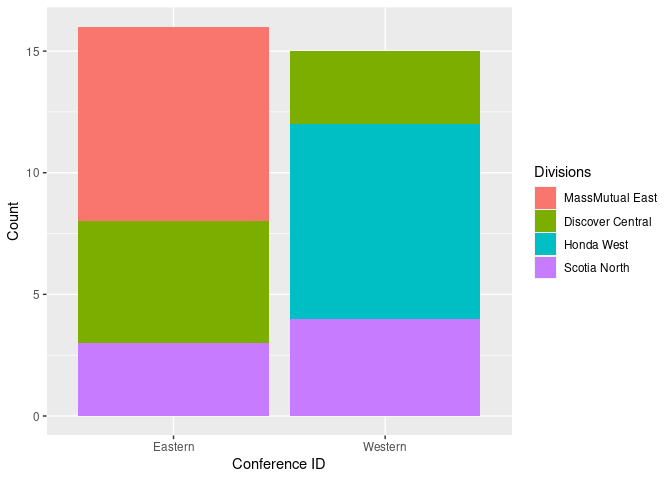
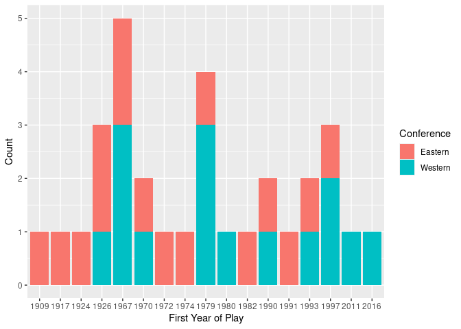
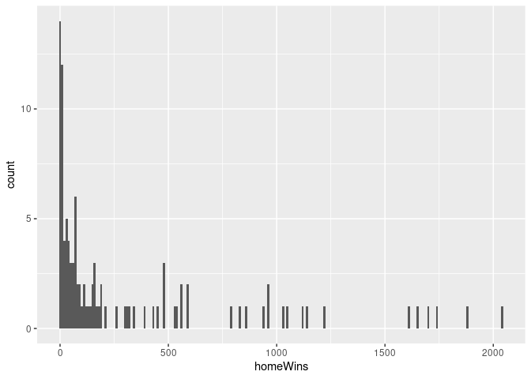
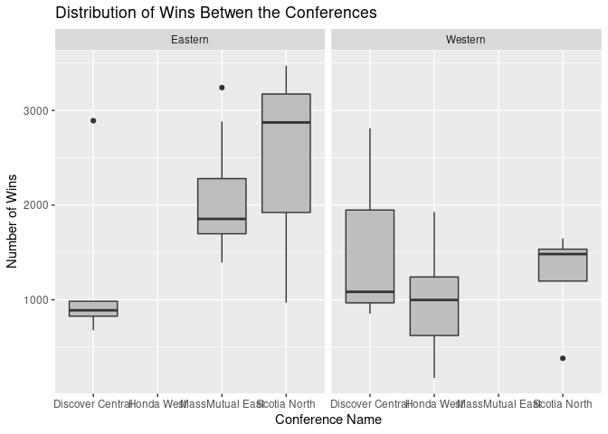
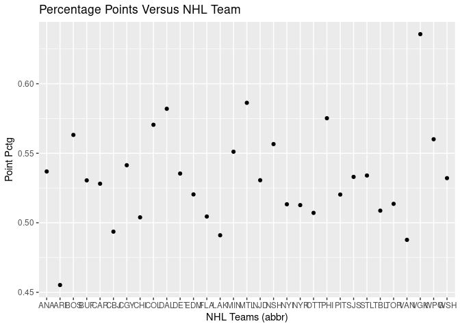
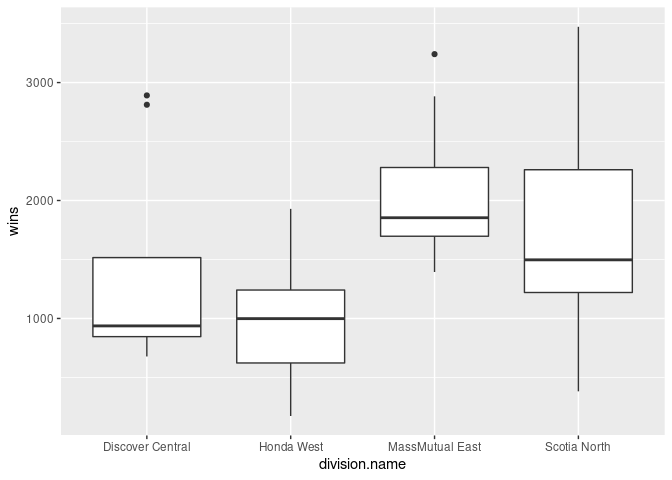
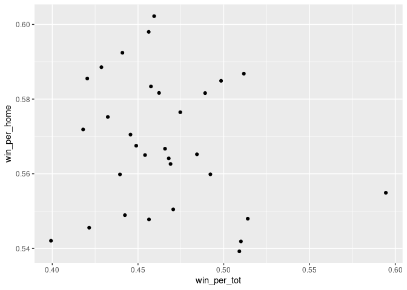

Project 1
================
Halid Kopanski
6/14/2021

  - [Set up of API Script](#set-up-of-api-script)
  - [Create data functions](#create-data-functions)
  - [Exploratory Data Analysis](#exploratory-data-analysis)
  - [Team Specific Information](#team-specific-information)
  - [Setup ID Data](#setup-id-data)
  - [Display Data](#display-data)
  - [One Stop Shop Data](#one-stop-shop-data)

## Set up of API Script

``` r
library(httr)
library(jsonlite)
library(tidyverse)
library(DT)
library(RSQLite)
library(bigrquery)
library(DBI)
library(knitr)
```

## Create data functions

The following functions pull data from two sources:

<https://statsapi.web.nhl.com/api/v1>

and

<https://records.nhl.com/site/api>

The data can be parsed during the request using modifiers or it can be
parsed afterwards. There are 6 functions in this section:

get\_db\_stats: to pull teams data from statsapi.web.nhl.com
get\_db\_records: to pull franchise data from records.nhl.com
get\_records: to pull franchise details data from records.nhl.com

``` r
get_db_stats <- function(endpoint = NULL, modifier = NULL){
  base <- "https://statsapi.web.nhl.com/api/v1"
  
  URL <- paste0(base, "/" , endpoint, modifier)
  temp_con <- GET(URL)
  temp_text <- content(temp_con, "text", encoding = "UTF-8")
  temp_JSON <- fromJSON(temp_text, flatten = TRUE)
  return(as_tibble(temp_JSON))
}

get_db_records <- function(endpoint = NULL, modifier = NULL){
  base <- "https://records.nhl.com/site/api"
  
  URL <- paste0(base, "/" , endpoint, modifier)
  temp_con <- GET(URL)
  temp_text <- content(temp_con, "text", encoding = "UTF-8")
  temp_JSON <- fromJSON(temp_text, flatten = TRUE)
  return(as_tibble(temp_JSON))
}

# This is to pull team specific information
get_records <- function(team = NULL, ID = NULL){
  df_franchise_det <- get_db_records('franchise-detail')
  df_franchise_det <- df_franchise_det$data %>% rowwise() %>%
    mutate(short_name = tail(strsplit(teamFullName, " ")[[1]], n = 1))
    if(is.null(team) & !is.null(ID)){
        temp_string <- paste0('franchise-season-records?cayenneExp=franchiseId=', as.character(ID))
        get_db_records(temp_string)}
    else if(!is.null(team)){
        team_alt = tail(strsplit(team, " ")[[1]], n = 1)
        temp_ID <- df_franchise_det %>% filter(toupper(short_name) == toupper(team_alt)) %>% select(id)
        temp_string <- paste0('franchise-season-records?cayenneExp=franchiseId=', as.character(temp_ID))
        get_db_records(temp_string)
    }
}

# This pulls goalie information
get_goalie_data <- function(team = NULL, ID = NULL){
  df_franchise_det <- get_db_records('franchise-detail')
  df_franchise_det <- df_franchise_det$data %>% rowwise() %>%
    mutate(short_name = tail(strsplit(teamFullName, " ")[[1]], n = 1))
  if(is.null(team) & !is.null(ID)){
    temp_string <- paste0('franchise-goalie-records?cayenneExp=franchiseId=', as.character(ID))
    get_db_records(temp_string)}
  else if(!is.null(team)){
    team_alt = tail(strsplit(team, " ")[[1]], n = 1)
    temp_ID <- df_franchise_det %>% filter(toupper(short_name) == toupper(team_alt)) %>% select(id)
    temp_string <- paste0('franchise-goalie-records?cayenneExp=franchiseId=', as.character(temp_ID))
    get_db_records(temp_string)
  }
}

# This pulls skater information
get_skater_data <- function(team = NULL, ID = NULL){
  df_franchise_det <- get_db_records('franchise-detail')
  df_franchise_det <- df_franchise_det$data %>% rowwise() %>%
    mutate(short_name = tail(strsplit(teamFullName, " ")[[1]], n = 1))
  if(is.null(team) & !is.null(ID)){
    temp_string <- paste0('franchise-skater-records?cayenneExp=franchiseId=', as.character(ID))
    get_db_records(temp_string)}
  else if(!is.null(team)){
    team_alt = tail(strsplit(team, " ")[[1]], n = 1)
    temp_ID <- df_franchise_det %>% filter(toupper(short_name) == toupper(team_alt)) %>% select(id)
    temp_string <- paste0('franchise-skater-records?cayenneExp=franchiseId=', as.character(temp_ID))
    get_db_records(temp_string)
  }
}

get_team_stats2 <- function(team = NULL){
  df_franchise_det <- get_db_records('franchise-detail')
  df_franchise_det <- df_franchise_det$data %>% rowwise() %>%
    mutate(short_name = tail(strsplit(teamFullName, " ")[[1]], n = 1))
  
  if(is.numeric(team)){
    temp_string <- paste0('teams/', as.character(team))
    return(get_db_stats(temp_string, '?expand=team.stats'))}
  
  else if(is.character(team)){
    team_alt = tail(strsplit(team, " ")[[1]], n = 1)
    temp_ID <- df_franchise_det %>% filter(toupper(short_name) == toupper(team_alt)) %>% select(id)
    temp_string <- paste0('teams/', as.character(temp_ID))
    temp_df <- get_db_stats(temp_string, '?expand=team.stats')
    temp_df <- temp_df$teams$teamStats[[1]]
    temp_df <- temp_df$splits[[1]]
    return(temp_df)}
  
  else {
    return(get_db_stats('teams'))
  }
}
```

## Exploratory Data Analysis

The functions developed in the prior section will be used to connect to
and to pull data from the NHL API service.

    ## [1] "id"               "firstSeasonId"    "fullName"         "lastSeasonId"     "mostRecentTeamId" "teamAbbrev"       "teamCommonName"  
    ## [8] "teamPlaceName"

    ##  [1] "id"                 "activeFranchise"    "firstSeasonId"      "franchiseId"        "gameTypeId"         "gamesPlayed"       
    ##  [7] "goalsAgainst"       "goalsFor"           "homeLosses"         "homeOvertimeLosses" "homeTies"           "homeWins"          
    ## [13] "lastSeasonId"       "losses"             "overtimeLosses"     "penaltyMinutes"     "pointPctg"          "points"            
    ## [19] "roadLosses"         "roadOvertimeLosses" "roadTies"           "roadWins"           "shootoutLosses"     "shootoutWins"      
    ## [25] "shutouts"           "teamId"             "teamName"           "ties"               "triCode"            "wins"

    ##  [1] "id"                    "active"                "captainHistory"        "coachingHistory"       "dateAwarded"          
    ##  [6] "directoryUrl"          "firstSeasonId"         "generalManagerHistory" "heroImageUrl"          "mostRecentTeamId"     
    ## [11] "retiredNumbersSummary" "teamAbbrev"            "teamFullName"

    ##  [1] "id"                        "fewestGoals"               "fewestGoalsAgainst"        "fewestGoalsAgainstSeasons" "fewestGoalsSeasons"       
    ##  [6] "fewestLosses"              "fewestLossesSeasons"       "fewestPoints"              "fewestPointsSeasons"       "fewestTies"               
    ## [11] "fewestTiesSeasons"         "fewestWins"                "fewestWinsSeasons"         "franchiseId"               "franchiseName"            
    ## [16] "homeLossStreak"            "homeLossStreakDates"       "homePointStreak"           "homePointStreakDates"      "homeWinStreak"            
    ## [21] "homeWinStreakDates"        "homeWinlessStreak"         "homeWinlessStreakDates"    "lossStreak"                "lossStreakDates"          
    ## [26] "mostGameGoals"             "mostGameGoalsDates"        "mostGoals"                 "mostGoalsAgainst"          "mostGoalsAgainstSeasons"  
    ## [31] "mostGoalsSeasons"          "mostLosses"                "mostLossesSeasons"         "mostPenaltyMinutes"        "mostPenaltyMinutesSeasons"
    ## [36] "mostPoints"                "mostPointsSeasons"         "mostShutouts"              "mostShutoutsSeasons"       "mostTies"                 
    ## [41] "mostTiesSeasons"           "mostWins"                  "mostWinsSeasons"           "pointStreak"               "pointStreakDates"         
    ## [46] "roadLossStreak"            "roadLossStreakDates"       "roadPointStreak"           "roadPointStreakDates"      "roadWinStreak"            
    ## [51] "roadWinStreakDates"        "roadWinlessStreak"         "roadWinlessStreakDates"    "winStreak"                 "winStreakDates"           
    ## [56] "winlessStreak"             "winlessStreakDates"

    ##  [1] "id"                      "activePlayer"            "firstName"               "franchiseId"             "franchiseName"          
    ##  [6] "gameTypeId"              "gamesPlayed"             "lastName"                "losses"                  "mostGoalsAgainstDates"  
    ## [11] "mostGoalsAgainstOneGame" "mostSavesDates"          "mostSavesOneGame"        "mostShotsAgainstDates"   "mostShotsAgainstOneGame"
    ## [16] "mostShutoutsOneSeason"   "mostShutoutsSeasonIds"   "mostWinsOneSeason"       "mostWinsSeasonIds"       "overtimeLosses"         
    ## [21] "playerId"                "positionCode"            "rookieGamesPlayed"       "rookieShutouts"          "rookieWins"             
    ## [26] "seasons"                 "shutouts"                "ties"                    "wins"

    ##  [1] "id"                          "activePlayer"                "assists"                     "firstName"                  
    ##  [5] "franchiseId"                 "franchiseName"               "gameTypeId"                  "gamesPlayed"                
    ##  [9] "goals"                       "lastName"                    "mostAssistsGameDates"        "mostAssistsOneGame"         
    ## [13] "mostAssistsOneSeason"        "mostAssistsSeasonIds"        "mostGoalsGameDates"          "mostGoalsOneGame"           
    ## [17] "mostGoalsOneSeason"          "mostGoalsSeasonIds"          "mostPenaltyMinutesOneSeason" "mostPenaltyMinutesSeasonIds"
    ## [21] "mostPointsGameDates"         "mostPointsOneGame"           "mostPointsOneSeason"         "mostPointsSeasonIds"        
    ## [25] "penaltyMinutes"              "playerId"                    "points"                      "positionCode"               
    ## [29] "rookieGamesPlayed"           "rookiePoints"                "seasons"

    ##  [1] "id"                    "name"                  "link"                  "abbreviation"          "teamName"             
    ##  [6] "locationName"          "firstYearOfPlay"       "shortName"             "officialSiteUrl"       "franchiseId"          
    ## [11] "active"                "venue.name"            "venue.link"            "venue.city"            "venue.id"             
    ## [16] "venue.timeZone.id"     "venue.timeZone.offset" "venue.timeZone.tz"     "division.id"           "division.name"        
    ## [21] "division.link"         "conference.id"         "conference.name"       "conference.link"       "franchise.franchiseId"
    ## [26] "franchise.teamName"    "franchise.link"

    ## NULL

## Team Specific Information

| id | franchiseName       | lossStreak | winStreak | mostGoals | fewestGoals |
| -: | :------------------ | ---------: | --------: | --------: | ----------: |
| 10 | Toronto Maple Leafs |         10 |        10 |       337 |         147 |

    ##  [1] "id"                      "activePlayer"            "firstName"               "franchiseId"             "franchiseName"          
    ##  [6] "gameTypeId"              "gamesPlayed"             "lastName"                "losses"                  "mostGoalsAgainstDates"  
    ## [11] "mostGoalsAgainstOneGame" "mostSavesDates"          "mostSavesOneGame"        "mostShotsAgainstDates"   "mostShotsAgainstOneGame"
    ## [16] "mostShutoutsOneSeason"   "mostShutoutsSeasonIds"   "mostWinsOneSeason"       "mostWinsSeasonIds"       "overtimeLosses"         
    ## [21] "playerId"                "positionCode"            "rookieGamesPlayed"       "rookieShutouts"          "rookieWins"             
    ## [26] "seasons"                 "shutouts"                "ties"                    "wins"

    ##  [1] "id"                          "activePlayer"                "assists"                     "firstName"                  
    ##  [5] "franchiseId"                 "franchiseName"               "gameTypeId"                  "gamesPlayed"                
    ##  [9] "goals"                       "lastName"                    "mostAssistsGameDates"        "mostAssistsOneGame"         
    ## [13] "mostAssistsOneSeason"        "mostAssistsSeasonIds"        "mostGoalsGameDates"          "mostGoalsOneGame"           
    ## [17] "mostGoalsOneSeason"          "mostGoalsSeasonIds"          "mostPenaltyMinutesOneSeason" "mostPenaltyMinutesSeasonIds"
    ## [21] "mostPointsGameDates"         "mostPointsOneGame"           "mostPointsOneSeason"         "mostPointsSeasonIds"        
    ## [25] "penaltyMinutes"              "playerId"                    "points"                      "positionCode"               
    ## [29] "rookieGamesPlayed"           "rookiePoints"                "seasons"

| firstName | lastName | mostSavesOneGame | gamesPlayed |
| :-------- | :------- | ---------------: | ----------: |
| Turk      | Broda    |               NA |         629 |
| Johnny    | Bower    |               50 |         475 |
| Curtis    | Joseph   |               46 |         270 |
| Frederik  | Andersen |               54 |         268 |
| Harry     | Lumley   |               48 |         267 |
| Lorne     | Chabot   |               NA |         214 |

|   |  0 |   1 |  2 |  3 | 4 | 5 | 6 |
| :- | -: | --: | -: | -: | -: | -: | -: |
| C | 55 |  77 | 60 | 36 | 9 | 1 | 2 |
| D | 93 | 152 | 40 |  5 | 2 | 1 | 0 |
| L | 56 |  57 | 52 | 31 | 7 | 0 | 0 |
| R | 40 |  55 | 52 | 27 | 4 | 3 | 0 |

## Setup ID Data

| id | teamCommonName |
| -: | :------------- |
|  1 | Canadiens      |
|  5 | Maple Leafs    |
|  6 | Bruins         |
| 10 | Rangers        |
| 11 | Blackhawks     |
| 12 | Red Wings      |
| 14 | Kings          |
| 15 | Stars          |
| 16 | Flyers         |
| 17 | Penguins       |
| 18 | Blues          |
| 19 | Sabres         |
| 20 | Canucks        |
| 21 | Flames         |
| 22 | Islanders      |
| 23 | Devils         |
| 24 | Capitals       |
| 25 | Oilers         |
| 26 | Hurricanes     |
| 27 | Avalanche      |
| 28 | Coyotes        |
| 29 | Sharks         |
| 30 | Senators       |
| 31 | Lightning      |
| 32 | Ducks          |
| 33 | Panthers       |
| 34 | Predators      |
| 35 | Jets           |
| 36 | Blue Jackets   |
| 37 | Wild           |
| 38 | Golden Knights |
| 39 | Kraken         |

## Display Data

    ## [1] 32

    ## [1] 31

<!-- --><!-- --><!-- --><!-- --><!-- --><!-- --><!-- -->

## One Stop Shop Data

<table class="kable_wrapper">

<tbody>

<tr>

<td>

| id | firstSeasonId | fullName            | lastSeasonId | mostRecentTeamId |
| -: | ------------: | :------------------ | -----------: | ---------------: |
|  1 |      19171918 | Montréal Canadiens  |           NA |                8 |
|  2 |      19171918 | Montreal Wanderers  |     19171918 |               41 |
|  3 |      19171918 | St. Louis Eagles    |     19341935 |               45 |
|  4 |      19191920 | Hamilton Tigers     |     19241925 |               37 |
|  5 |      19171918 | Toronto Maple Leafs |           NA |               10 |
|  6 |      19241925 | Boston Bruins       |           NA |                6 |

</td>

<td>

| id | activeFranchise | firstSeasonId | franchiseId | gameTypeId |
| -: | --------------: | ------------: | ----------: | ---------: |
|  1 |               1 |      19821983 |          23 |          2 |
|  2 |               1 |      19821983 |          23 |          3 |
|  3 |               1 |      19721973 |          22 |          2 |
|  4 |               1 |      19721973 |          22 |          3 |
|  5 |               1 |      19261927 |          10 |          2 |
|  6 |               1 |      19261927 |          10 |          3 |

</td>

<td>

| firstName | lastName | mostSavesOneGame | gamesPlayed |
| :-------- | :------- | ---------------: | ----------: |
| Marty     | Turco    |               49 |         509 |
| Kari      | Lehtonen |               47 |         445 |
| Cesare    | Maniago  |               54 |         420 |
| Gilles    | Meloche  |               49 |         327 |
| Don       | Beaupre  |               52 |         315 |
| Ed        | Belfour  |               44 |         307 |

</td>

<td>

|   |  0 |  1 |  2 |  3 | 4 | 5 |
| :- | -: | -: | -: | -: | -: | -: |
| C | 35 | 47 | 46 | 18 | 6 | 1 |
| D | 80 | 97 | 24 |  5 | 0 | 0 |
| L | 24 | 54 | 36 | 18 | 2 | 0 |
| R | 26 | 46 | 36 | 14 | 4 | 0 |

</td>

<td>

| stat.gamesPlayed | stat.wins | stat.losses | stat.ot | stat.pts |
| ---------------: | :-------- | :---------- | :------ | :------- |
|               56 | 36        | 15          | 5       | 77       |
|               NA | 6th       | 6th         | 20th    | 6th      |

</td>

<td>

| id | franchiseName | lossStreak | winStreak | mostGoals | fewestGoals |
| -: | :------------ | ---------: | --------: | --------: | ----------: |
| 25 | Dallas Stars  |         10 |         7 |       346 |         189 |

</td>

</tr>

</tbody>

</table>
