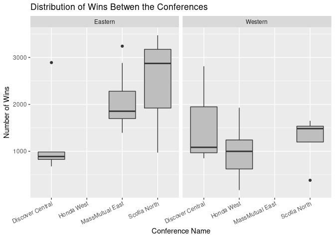
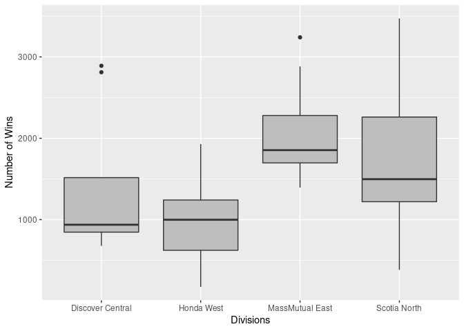
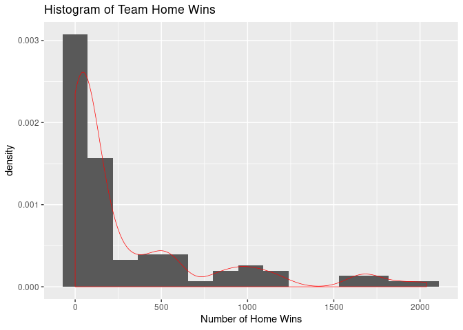

Project 1
================

## Link to repo

[GIT repo](https://github.com/hkopanski/ST_558_Proj_1)

## Set up of API Script

The following libraries are used in this script

``` r
library(httr)
library(jsonlite)
library(tidyverse)
library(DT)
library(RSQLite)
library(DBI)
library(knitr)
```

## Create data functions

The following functions pull data from two sources:

<https://statsapi.web.nhl.com/api/v1>

and

<https://records.nhl.com/site/api>

The data can be parsed during the request using modifiers or it can be
parsed afterwards. There are 6 functions in this section:

  - get\_db\_stats: to pull teams data from statsapi.web.nhl.com
  - get\_db\_records: to pull franchise data from records.nhl.com
  - get\_records: to pull franchise details data from records.nhl.com
  - get\_goalie\_data: pull goalie stats for a particular team
  - get\_skater\_data: pull skater stats for a particular team
  - get\_team\_stats2: pull team stats for a specific team

All functions output the data in the form of a tibble.

``` r
get_db_stats <- function(endpoint = NULL, modifier = NULL){
  base <- "https://statsapi.web.nhl.com/api/v1"
  
  URL <- paste0(base, "/" , endpoint, modifier)
  temp_con <- GET(URL)
  temp_text <- content(temp_con, "text", encoding = "UTF-8")
  temp_JSON <- fromJSON(temp_text, flatten = TRUE)
  return(as_tibble(temp_JSON))
}

get_db_records <- function(endpoint = NULL, modifier = NULL){
  base <- "https://records.nhl.com/site/api"
  
  URL <- paste0(base, "/" , endpoint, modifier)
  temp_con <- GET(URL)
  temp_text <- content(temp_con, "text", encoding = "UTF-8")
  temp_JSON <- fromJSON(temp_text, flatten = TRUE)
  return(as_tibble(temp_JSON))
}

# This is to pull team specific information
get_records <- function(team = NULL, ID = NULL){
  df_franchise_det <- get_db_records('franchise-detail')
  df_franchise_det <- df_franchise_det$data %>% rowwise() %>%
    mutate(short_name = tail(strsplit(teamFullName, " ")[[1]], n = 1))
    if(is.null(team) & !is.null(ID)){
        temp_string <- paste0('franchise-season-records?cayenneExp=franchiseId=', as.character(ID))
        get_db_records(temp_string)}
    else if(!is.null(team)){
        team_alt = tail(strsplit(team, " ")[[1]], n = 1)
        temp_ID <- df_franchise_det %>% filter(toupper(short_name) == toupper(team_alt)) %>% select(id)
        temp_string <- paste0('franchise-season-records?cayenneExp=franchiseId=', as.character(temp_ID))
        get_db_records(temp_string)
    }
}

# This pulls goalie information
get_goalie_data <- function(team = NULL, ID = NULL){
  df_franchise_det <- get_db_records('franchise-detail')
  df_franchise_det <- df_franchise_det$data %>% rowwise() %>%
    mutate(short_name = tail(strsplit(teamFullName, " ")[[1]], n = 1))
  if(is.null(team) & !is.null(ID)){
    temp_string <- paste0('franchise-goalie-records?cayenneExp=franchiseId=', as.character(ID))
    get_db_records(temp_string)}
  else if(!is.null(team)){
    team_alt = tail(strsplit(team, " ")[[1]], n = 1)
    temp_ID <- df_franchise_det %>% filter(toupper(short_name) == toupper(team_alt)) %>% select(id)
    temp_string <- paste0('franchise-goalie-records?cayenneExp=franchiseId=', as.character(temp_ID))
    get_db_records(temp_string)
  }
}

# This pulls skater information
get_skater_data <- function(team = NULL, ID = NULL){
  df_franchise_det <- get_db_records('franchise-detail')
  df_franchise_det <- df_franchise_det$data %>% rowwise() %>%
    mutate(short_name = tail(strsplit(teamFullName, " ")[[1]], n = 1))
  if(is.null(team) & !is.null(ID)){
    temp_string <- paste0('franchise-skater-records?cayenneExp=franchiseId=', as.character(ID))
    get_db_records(temp_string)}
  else if(!is.null(team)){
    team_alt = tail(strsplit(team, " ")[[1]], n = 1)
    temp_ID <- df_franchise_det %>% filter(toupper(short_name) == toupper(team_alt)) %>% select(id)
    temp_string <- paste0('franchise-skater-records?cayenneExp=franchiseId=', as.character(temp_ID))
    get_db_records(temp_string)
  }
}

get_team_stats2 <- function(team = NULL){
  df_franchise_det <- get_db_records('franchise-detail')
  df_franchise_det <- df_franchise_det$data %>% rowwise() %>%
    mutate(short_name = tail(strsplit(teamFullName, " ")[[1]], n = 1))
  
  if(is.numeric(team)){
    temp_string <- paste0('teams/', as.character(team))
    return(get_db_stats(temp_string, '?expand=team.stats'))}
  
  else if(is.character(team)){
    team_alt = tail(strsplit(team, " ")[[1]], n = 1)
    temp_ID <- df_franchise_det %>% filter(toupper(short_name) == toupper(team_alt)) %>% select(id)
    temp_string <- paste0('teams/', as.character(temp_ID))
    temp_df <- get_db_stats(temp_string, '?expand=team.stats')
    temp_df <- temp_df$teams$teamStats[[1]]
    temp_df <- temp_df$splits[[1]]
    return(temp_df)}
  
  else {
    return(get_db_stats('teams'))
  }
}
```

## Exploratory Data Analysis

The functions developed in the prior section will be used to connect to
and to pull data from the NHL API service. First, the some datasets will
be created using the following commands.

Here are the column names for all the datasets. In the case of the data
sets for a particular team, one was chosen at random.

``` r
# Column names of each dataset
names(df_franchise$data)
```

    ## [1] "id"               "firstSeasonId"    "fullName"         "lastSeasonId"     "mostRecentTeamId" "teamAbbrev"      
    ## [7] "teamCommonName"   "teamPlaceName"

``` r
names(df_fran_team_tot$data)
```

    ##  [1] "id"                 "activeFranchise"    "firstSeasonId"      "franchiseId"        "gameTypeId"         "gamesPlayed"       
    ##  [7] "goalsAgainst"       "goalsFor"           "homeLosses"         "homeOvertimeLosses" "homeTies"           "homeWins"          
    ## [13] "lastSeasonId"       "losses"             "overtimeLosses"     "penaltyMinutes"     "pointPctg"          "points"            
    ## [19] "roadLosses"         "roadOvertimeLosses" "roadTies"           "roadWins"           "shootoutLosses"     "shootoutWins"      
    ## [25] "shutouts"           "teamId"             "teamName"           "ties"               "triCode"            "wins"

``` r
names(df_franchise_det$data)
```

    ##  [1] "id"                    "active"                "captainHistory"        "coachingHistory"       "dateAwarded"          
    ##  [6] "directoryUrl"          "firstSeasonId"         "generalManagerHistory" "heroImageUrl"          "mostRecentTeamId"     
    ## [11] "retiredNumbersSummary" "teamAbbrev"            "teamFullName"

``` r
names(df_records$data) #Data for the Flyers
```

    ##  [1] "id"                        "fewestGoals"               "fewestGoalsAgainst"        "fewestGoalsAgainstSeasons"
    ##  [5] "fewestGoalsSeasons"        "fewestLosses"              "fewestLossesSeasons"       "fewestPoints"             
    ##  [9] "fewestPointsSeasons"       "fewestTies"                "fewestTiesSeasons"         "fewestWins"               
    ## [13] "fewestWinsSeasons"         "franchiseId"               "franchiseName"             "homeLossStreak"           
    ## [17] "homeLossStreakDates"       "homePointStreak"           "homePointStreakDates"      "homeWinStreak"            
    ## [21] "homeWinStreakDates"        "homeWinlessStreak"         "homeWinlessStreakDates"    "lossStreak"               
    ## [25] "lossStreakDates"           "mostGameGoals"             "mostGameGoalsDates"        "mostGoals"                
    ## [29] "mostGoalsAgainst"          "mostGoalsAgainstSeasons"   "mostGoalsSeasons"          "mostLosses"               
    ## [33] "mostLossesSeasons"         "mostPenaltyMinutes"        "mostPenaltyMinutesSeasons" "mostPoints"               
    ## [37] "mostPointsSeasons"         "mostShutouts"              "mostShutoutsSeasons"       "mostTies"                 
    ## [41] "mostTiesSeasons"           "mostWins"                  "mostWinsSeasons"           "pointStreak"              
    ## [45] "pointStreakDates"          "roadLossStreak"            "roadLossStreakDates"       "roadPointStreak"          
    ## [49] "roadPointStreakDates"      "roadWinStreak"             "roadWinStreakDates"        "roadWinlessStreak"        
    ## [53] "roadWinlessStreakDates"    "winStreak"                 "winStreakDates"            "winlessStreak"            
    ## [57] "winlessStreakDates"

``` r
names(df_goalie_bruins$data) #goalie data for the Bruins :(
```

    ##  [1] "id"                      "activePlayer"            "firstName"               "franchiseId"            
    ##  [5] "franchiseName"           "gameTypeId"              "gamesPlayed"             "lastName"               
    ##  [9] "losses"                  "mostGoalsAgainstDates"   "mostGoalsAgainstOneGame" "mostSavesDates"         
    ## [13] "mostSavesOneGame"        "mostShotsAgainstDates"   "mostShotsAgainstOneGame" "mostShutoutsOneSeason"  
    ## [17] "mostShutoutsSeasonIds"   "mostWinsOneSeason"       "mostWinsSeasonIds"       "overtimeLosses"         
    ## [21] "playerId"                "positionCode"            "rookieGamesPlayed"       "rookieShutouts"         
    ## [25] "rookieWins"              "seasons"                 "shutouts"                "ties"                   
    ## [29] "wins"

``` r
names(df_skater_bruins$data) #skater data for the Bruins
```

    ##  [1] "id"                          "activePlayer"                "assists"                     "firstName"                  
    ##  [5] "franchiseId"                 "franchiseName"               "gameTypeId"                  "gamesPlayed"                
    ##  [9] "goals"                       "lastName"                    "mostAssistsGameDates"        "mostAssistsOneGame"         
    ## [13] "mostAssistsOneSeason"        "mostAssistsSeasonIds"        "mostGoalsGameDates"          "mostGoalsOneGame"           
    ## [17] "mostGoalsOneSeason"          "mostGoalsSeasonIds"          "mostPenaltyMinutesOneSeason" "mostPenaltyMinutesSeasonIds"
    ## [21] "mostPointsGameDates"         "mostPointsOneGame"           "mostPointsOneSeason"         "mostPointsSeasonIds"        
    ## [25] "penaltyMinutes"              "playerId"                    "points"                      "positionCode"               
    ## [29] "rookieGamesPlayed"           "rookiePoints"                "seasons"

``` r
names(df_teams$teams)
```

    ##  [1] "id"                    "name"                  "link"                  "abbreviation"          "teamName"             
    ##  [6] "locationName"          "firstYearOfPlay"       "shortName"             "officialSiteUrl"       "franchiseId"          
    ## [11] "active"                "venue.name"            "venue.link"            "venue.city"            "venue.id"             
    ## [16] "venue.timeZone.id"     "venue.timeZone.offset" "venue.timeZone.tz"     "division.id"           "division.name"        
    ## [21] "division.link"         "conference.id"         "conference.name"       "conference.link"       "franchise.franchiseId"
    ## [26] "franchise.teamName"    "franchise.link"

``` r
names(df_bruins)
```

    ##  [1] "stat.gamesPlayed"              "stat.wins"                     "stat.losses"                  
    ##  [4] "stat.ot"                       "stat.pts"                      "stat.ptPctg"                  
    ##  [7] "stat.goalsPerGame"             "stat.goalsAgainstPerGame"      "stat.evGGARatio"              
    ## [10] "stat.powerPlayPercentage"      "stat.powerPlayGoals"           "stat.powerPlayGoalsAgainst"   
    ## [13] "stat.powerPlayOpportunities"   "stat.penaltyKillPercentage"    "stat.shotsPerGame"            
    ## [16] "stat.shotsAllowed"             "stat.winScoreFirst"            "stat.winOppScoreFirst"        
    ## [19] "stat.winLeadFirstPer"          "stat.winLeadSecondPer"         "stat.winOutshootOpp"          
    ## [22] "stat.winOutshotByOpp"          "stat.faceOffsTaken"            "stat.faceOffsWon"             
    ## [25] "stat.faceOffsLost"             "stat.faceOffWinPercentage"     "stat.shootingPctg"            
    ## [28] "stat.savePctg"                 "stat.penaltyKillOpportunities" "stat.savePctRank"             
    ## [31] "stat.shootingPctRank"          "team.id"                       "team.name"                    
    ## [34] "team.link"

## Team Specific Information

Here is a few test scenarios for a handful of team specific datasets.

``` r
# Quick Test
df_temp_goalie <- get_goalie_data("Maple Leafs")
df_temp_skater <- get_skater_data("Maple Leafs")
df_temp <- get_records("Maple Leafs")
df_temp$data %>% select(id, franchiseName, lossStreak, winStreak, mostGoals, fewestGoals) %>% knitr::kable()
```

| id | franchiseName       | lossStreak | winStreak | mostGoals | fewestGoals |
| -: | :------------------ | ---------: | --------: | --------: | ----------: |
| 10 | Toronto Maple Leafs |         10 |        10 |       337 |         147 |

``` r
#names(df_temp_goalie$data)
df_temp_goalie <- get_goalie_data("Maple Leafs")
df_temp_skater <- get_skater_data("Maple Leafs")

names(df_temp_goalie$data)
```

    ##  [1] "id"                      "activePlayer"            "firstName"               "franchiseId"            
    ##  [5] "franchiseName"           "gameTypeId"              "gamesPlayed"             "lastName"               
    ##  [9] "losses"                  "mostGoalsAgainstDates"   "mostGoalsAgainstOneGame" "mostSavesDates"         
    ## [13] "mostSavesOneGame"        "mostShotsAgainstDates"   "mostShotsAgainstOneGame" "mostShutoutsOneSeason"  
    ## [17] "mostShutoutsSeasonIds"   "mostWinsOneSeason"       "mostWinsSeasonIds"       "overtimeLosses"         
    ## [21] "playerId"                "positionCode"            "rookieGamesPlayed"       "rookieShutouts"         
    ## [25] "rookieWins"              "seasons"                 "shutouts"                "ties"                   
    ## [29] "wins"

``` r
names(df_temp_skater$data)
```

    ##  [1] "id"                          "activePlayer"                "assists"                     "firstName"                  
    ##  [5] "franchiseId"                 "franchiseName"               "gameTypeId"                  "gamesPlayed"                
    ##  [9] "goals"                       "lastName"                    "mostAssistsGameDates"        "mostAssistsOneGame"         
    ## [13] "mostAssistsOneSeason"        "mostAssistsSeasonIds"        "mostGoalsGameDates"          "mostGoalsOneGame"           
    ## [17] "mostGoalsOneSeason"          "mostGoalsSeasonIds"          "mostPenaltyMinutesOneSeason" "mostPenaltyMinutesSeasonIds"
    ## [21] "mostPointsGameDates"         "mostPointsOneGame"           "mostPointsOneSeason"         "mostPointsSeasonIds"        
    ## [25] "penaltyMinutes"              "playerId"                    "points"                      "positionCode"               
    ## [29] "rookieGamesPlayed"           "rookiePoints"                "seasons"

Creating some stats and frequency tables.

``` r
df_temp_goalie$data %>% select(firstName, lastName, mostSavesOneGame, gamesPlayed) %>% 
  arrange(desc(gamesPlayed)) %>% head() %>% knitr::kable()
```

| firstName | lastName | mostSavesOneGame | gamesPlayed |
| :-------- | :------- | ---------------: | ----------: |
| Turk      | Broda    |               NA |         629 |
| Johnny    | Bower    |               50 |         475 |
| Curtis    | Joseph   |               46 |         270 |
| Frederik  | Andersen |               54 |         268 |
| Harry     | Lumley   |               48 |         267 |
| Lorne     | Chabot   |               NA |         214 |

``` r
df_temp_skater$data %>% select(positionCode, mostGoalsOneGame) %>% table() %>% knitr::kable()
```

|   |  0 |   1 |  2 |  3 | 4 | 5 | 6 |
| :- | -: | --: | -: | -: | -: | -: | -: |
| C | 55 |  77 | 60 | 36 | 9 | 1 | 2 |
| D | 93 | 152 | 40 |  5 | 2 | 1 | 0 |
| L | 56 |  57 | 52 | 31 | 7 | 0 | 0 |
| R | 40 |  55 | 52 | 27 | 4 | 3 | 0 |

## Setup ID Data

There seems to be descrepency between the number of active teams. This
was found to be due to the recent addition of the Seattle Kraken as an
expansion team. They are an active team but have not really participated
in too many games.

| id | teamCommonName |
| -: | :------------- |
|  1 | Canadiens      |
|  5 | Maple Leafs    |
|  6 | Bruins         |
| 10 | Rangers        |
| 11 | Blackhawks     |
| 12 | Red Wings      |
| 14 | Kings          |
| 15 | Stars          |
| 16 | Flyers         |
| 17 | Penguins       |
| 18 | Blues          |
| 19 | Sabres         |
| 20 | Canucks        |
| 21 | Flames         |
| 22 | Islanders      |
| 23 | Devils         |
| 24 | Capitals       |
| 25 | Oilers         |
| 26 | Hurricanes     |
| 27 | Avalanche      |
| 28 | Coyotes        |
| 29 | Sharks         |
| 30 | Senators       |
| 31 | Lightning      |
| 32 | Ducks          |
| 33 | Panthers       |
| 34 | Predators      |
| 35 | Jets           |
| 36 | Blue Jackets   |
| 37 | Wild           |
| 38 | Golden Knights |
| 39 | Kraken         |

    ##  [1] "Montréal Canadiens"    "Toronto Maple Leafs"   "Boston Bruins"         "New York Rangers"      "Chicago Blackhawks"   
    ##  [6] "Detroit Red Wings"     "Los Angeles Kings"     "Dallas Stars"          "Philadelphia Flyers"   "Pittsburgh Penguins"  
    ## [11] "St. Louis Blues"       "Buffalo Sabres"        "Vancouver Canucks"     "Calgary Flames"        "New York Islanders"   
    ## [16] "New Jersey Devils"     "Washington Capitals"   "Edmonton Oilers"       "Carolina Hurricanes"   "Colorado Avalanche"   
    ## [21] "Arizona Coyotes"       "San Jose Sharks"       "Ottawa Senators"       "Tampa Bay Lightning"   "Anaheim Ducks"        
    ## [26] "Florida Panthers"      "Nashville Predators"   "Winnipeg Jets"         "Columbus Blue Jackets" "Minnesota Wild"       
    ## [31] "Vegas Golden Knights"  "Seattle Kraken"

## Display Data

The following is an example of how to parse and join different data sets
and to visualize the data. From the charts, it can be seen that
conferences are not based on divisions. Also, that the eastern
conference seemed to have formed sooner than the western.

``` r
df_teams$teams %>% select(id, name) %>% nrow()
```

    ## [1] 32

``` r
df_teams$teams %>% filter(active == TRUE) %>% select(id, name) %>% nrow()
```

    ## [1] 31

``` r
# Bar charts based on conference and divisions.
df_teams$teams %>% filter(active == TRUE) %>% 
  ggplot(. ,aes(conference.name, fill = as.factor(division.id))) + geom_bar() + 
  labs(x = "Conference ID", y = "Count") + 
  scale_fill_discrete(name = "Divisions", 
                      labels = c("MassMutual East", 
                                 "Discover Central",
                                 "Honda West",
                                 "Scotia North"))
```

<!-- -->

``` r
df_teams$teams %>% filter(active == TRUE) %>% 
  ggplot(. ,aes(firstYearOfPlay)) + geom_bar(aes(fill = conference.name)) + 
  labs(x = "First Year of Play", y = "Count") +
  scale_fill_discrete(name = "Conference")
```

<!-- -->

From boxplot data Scotia North division has the highest average number
of wins in both conferences. Scotia North has a wider distribution in
the Eastern Conference than it does in the Western. Overall, Mass Mutual
East has the highest average wins regardless of conference. This
information needs further refinement because, number of games played
from older divisions/conferences can be skewing the data.

``` r
# Combining some endpoint data
df_fil_fran_tot <- df_fran_team_tot$data %>% filter(is.na(lastSeasonId) & gameTypeId == 2) %>% rename(abbreviation = triCode)
df_fil_team <- df_teams$teams %>% filter(active == TRUE)

#Rename a column in df_fil_fran_tot to match that of a column in df_fil_team and then inner join them on the newly renamed column

df_com <- df_fil_team %>% inner_join(., df_fil_fran_tot, by = 'abbreviation')

df_com %>% ggplot(., aes(x = division.name, y = wins)) + geom_boxplot(fill = "gray") +
  labs(title = "Distribution of Wins Betwen the Conferences", 
       x = "Conference Name", y = "Number of Wins") + facet_grid(cols = vars(conference.name)) +
  theme(axis.text.x = element_text(angle = 25, hjust=1))
```

<!-- -->

``` r
df_com %>% ggplot(., aes(x = division.name, y = wins)) + geom_boxplot(fill = 'gray') + 
  labs(x = "Divisions", y = "Number of Wins")
```

<!-- -->

Scatter plots of wins do not seem to point to any relationships in the
data. We can see that the Knights have the highest Percentage Points and
the Coyotes the lowest. Percent Home Wins versus Total Wins do not have
a relationship according to first glance at the scatter plot.

``` r
df_com %>% ggplot(., aes(x = abbreviation, y = pointPctg)) + geom_point() +
  labs(title = "Percentage Points Versus NHL Team", x = "NHL Teams (abbr)", y = "Point Pctg") +
  theme(axis.text.x = element_text(angle = 45, hjust = 1))
```

<!-- -->

``` r
df_com %>% mutate(win_per_tot = wins / gamesPlayed, win_per_home = homeWins / wins) %>% 
  ggplot(., aes(x = win_per_tot, y = win_per_home)) + geom_point(aes(color = as.factor(division.id))) + 
  labs(x = "Percent Wins from Total Games", y = "Percent Wins Home Games") + 
  scale_color_discrete(name = "Divisions", 
                      labels = c("MassMutual East", 
                                 "Discover Central",
                                 "Honda West",
                                 "Scotia North")) 
```

<!-- -->
Displaying Home wins in a Histogram shows heavy right skew but this
could be due to teams with longer tentures having played more games.
When creating a histogram base on Home Wins as a percentage of total
wins, a more even distribution is observed.

``` r
df_fran_team_tot$data %>% ggplot(., aes(homeWins)) + geom_histogram(aes(y = ..density..), bins = 15) + 
  geom_density(adjust = 0.75, color = 'red', size = 0.25, outline.type = 'full') + 
  labs(x = "Number of Home Wins", title = "Histogram of Team Home Wins")
```

<!-- -->

``` r
df_com %>% mutate(win_per_home = homeWins / wins) %>% 
  ggplot(., aes(win_per_home)) + geom_histogram(aes(y = ..density..), bins = 15) + 
  geom_density(adjust = 0.75, color = 'red', size = 0.25, outline.type = 'full') +
  labs(x = "Home Wins Percentage", title = "Histogram of Home Wins as a Percentage of Total Wins")
```

<!-- -->

## One Stop Shop Data

If one does not want to run individual functions the grab\_all function
can be run instead. The function uses 5 arguments: - all: to return all
nhl data - team: to return specific team data - ID: same as team but
uses the ID number instead - goalie: to return goalie information -
skater: to return skater information. - The output for the function is a
named list containing all the desired information.
<Font color = red>**WARNING** Named list can be large\! </font>.

``` r
grab_all <- function(all = FALSE, team = NULL, ID = NULL, goalie = FALSE, skater = FALSE){
  if(all == TRUE){
    df_franchise <- get_db_records('franchise') 
    df_fran_team_tot <- get_db_records('franchise-team-totals')
  } else if(all == FALSE) {
    df_franchise <- NULL
    df_fran_team_tot <- NULL}
 
  if(!is.null(team) & is.null(ID)){
    df_team_data <- get_records(team)
    df_team_stats <- get_team_stats2(team)
  } else if(is.null(team) & !is.null(ID)) {
    df_team_data <- get_records(ID = ID)
    df_team_stats <- get_team_stats2(ID)
  } else if(!is.null(team) & !is.null(ID)) {
    df_team_data <- get_records(team)
    df_team_stats <- get_team_stats2(team)
  } else if(is.null(team) & is.null(ID)) {
    df_team_data <- NULL
    df_team_stats <- NULL
  }
  
  if(goalie == TRUE & !is.null(team) & is.null(ID)){
    df_temp_goalie <- get_goalie_data(team)
  } else if(goalie == TRUE & is.null(team) & !is.null(ID)){
    df_temp_goalie <- get_goalie_data(ID = ID)
  } else if(goalie == TRUE & is.null(team) & is.null(ID)){
    df_temp_goalie <- get_goalie_data(team)
  } else if(goalie == FALSE){
    df_temp_goalie <- NULL
  }
  
  if(skater == TRUE & !is.null(team) & is.null(ID)){
    df_temp_skater <- get_skater_data(team)
  } else if(skater == TRUE & is.null(team) & !is.null(ID)){
    df_temp_skater <- get_skater_data(ID = ID)
  } else if(skater == TRUE & is.null(team) & is.null(ID)){
    df_temp_skater <- get_skater_data(team)
  } else if(skater == FALSE){
    df_temp_skater <- NULL
  }
  
  df_list <- list("franchises" = df_franchise, "team total" = df_fran_team_tot, 
                  "goalie information" = df_temp_goalie, 
                  "skater information" = df_temp_skater, 
                  "team data" = df_team_data, 
                  "team stats" = df_team_stats)
  
  df_list <- df_list[-which(sapply(df_list, is.null))]
  
  return(df_list)
}

# Test grab_all function
grab_all(all = TRUE, team = 'stars')
```

    ## $franchises
    ## # A tibble: 39 x 2
    ##    data$id $firstSeasonId $fullName            $lastSeasonId $mostRecentTeamId $teamAbbrev $teamCommonName $teamPlaceName total
    ##      <int>          <int> <chr>                        <int>             <int> <chr>       <chr>           <chr>          <int>
    ##  1       1       19171918 Montréal Canadiens              NA                 8 MTL         Canadiens       Montréal          39
    ##  2       2       19171918 Montreal Wanderers        19171918                41 MWN         Wanderers       Montreal          39
    ##  3       3       19171918 St. Louis Eagles          19341935                45 SLE         Eagles          St. Louis         39
    ##  4       4       19191920 Hamilton Tigers           19241925                37 HAM         Tigers          Hamilton          39
    ##  5       5       19171918 Toronto Maple Leafs             NA                10 TOR         Maple Leafs     Toronto           39
    ##  6       6       19241925 Boston Bruins                   NA                 6 BOS         Bruins          Boston            39
    ##  7       7       19241925 Montreal Maroons          19371938                43 MMR         Maroons         Montreal          39
    ##  8       8       19251926 Brooklyn Americans        19411942                51 BRK         Americans       Brooklyn          39
    ##  9       9       19251926 Philadelphia Quakers      19301931                39 QUA         Quakers         Philadelphia      39
    ## 10      10       19261927 New York Rangers                NA                 3 NYR         Rangers         New York          39
    ## # … with 29 more rows
    ## 
    ## $`team total`
    ## # A tibble: 105 x 2
    ##    data$id $activeFranchise $firstSeasonId $franchiseId $gameTypeId $gamesPlayed $goalsAgainst $goalsFor $homeLosses total
    ##      <int>            <int>          <int>        <int>       <int>        <int>         <int>     <int>       <int> <int>
    ##  1       1                1       19821983           23           2         2993          8902      8792         525   105
    ##  2       2                1       19821983           23           3          257           634       697          53   105
    ##  3       3                1       19721973           22           2         3788         11907     12045         678   105
    ##  4       4                1       19721973           22           3          309           897       983          53   105
    ##  5       5                1       19261927           10           2         6560         20020     20041        1143   105
    ##  6       6                1       19261927           10           3          518          1447      1404         104   105
    ##  7       7                1       19671968           16           3          449          1332      1335          97   105
    ##  8       8                1       19671968           16           2         4171         12255     13690         584   105
    ##  9       9                1       19671968           17           2         4171         14049     13874         683   105
    ## 10      10                1       19671968           17           3          391          1131      1190          85   105
    ## # … with 95 more rows
    ## 
    ## $`team data`
    ## # A tibble: 1 x 2
    ##   data$id $fewestGoals $fewestGoalsAgain… $fewestGoalsAgains… $fewestGoalsSeas… $fewestLosses $fewestLossesSea… $fewestPoints total
    ##     <int>        <int>              <int> <chr>               <chr>                     <int> <chr>                     <int> <int>
    ## 1      25          189                167 1997-98 (82)        1968-69 (76)                 17 2002-03 (82)                 45     1
    ## 
    ## $`team stats`
    ##   stat.gamesPlayed stat.wins stat.losses stat.ot stat.pts stat.ptPctg stat.goalsPerGame stat.goalsAgainstPerGame stat.evGGARatio
    ## 1               56        36          15       5       77        68.8             3.357                    2.875          1.2336
    ## 2               NA       6th         6th    20th      6th         6th               5th                     17th             8th
    ##   stat.powerPlayPercentage stat.powerPlayGoals stat.powerPlayGoalsAgainst stat.powerPlayOpportunities stat.penaltyKillPercentage
    ## 1                     24.8                  38                         26                         153                       84.0
    ## 2                      3rd                 6th                        5th                        24th                        5th
    ##   stat.shotsPerGame stat.shotsAllowed stat.winScoreFirst stat.winOppScoreFirst stat.winLeadFirstPer stat.winLeadSecondPer
    ## 1           29.4107           28.7857               0.75                   0.5                0.727                 0.929
    ## 2              18th              11th                6th                   6th                 20th                   6th
    ##   stat.winOutshootOpp stat.winOutshotByOpp stat.faceOffsTaken stat.faceOffsWon stat.faceOffsLost stat.faceOffWinPercentage
    ## 1               0.677                0.545               3134             1542              1592                      49.2
    ## 2                 5th                  5th               14th             13th              21st                      22nd
    ##   stat.shootingPctg stat.savePctg stat.penaltyKillOpportunities stat.savePctRank stat.shootingPctRank team.id           team.name
    ## 1              11.4           0.9                          <NA>             <NA>                 <NA>      15 Washington Capitals
    ## 2                NA            NA                          15th             19th                  2nd      15 Washington Capitals
    ##          team.link
    ## 1 /api/v1/teams/15
    ## 2 /api/v1/teams/15
